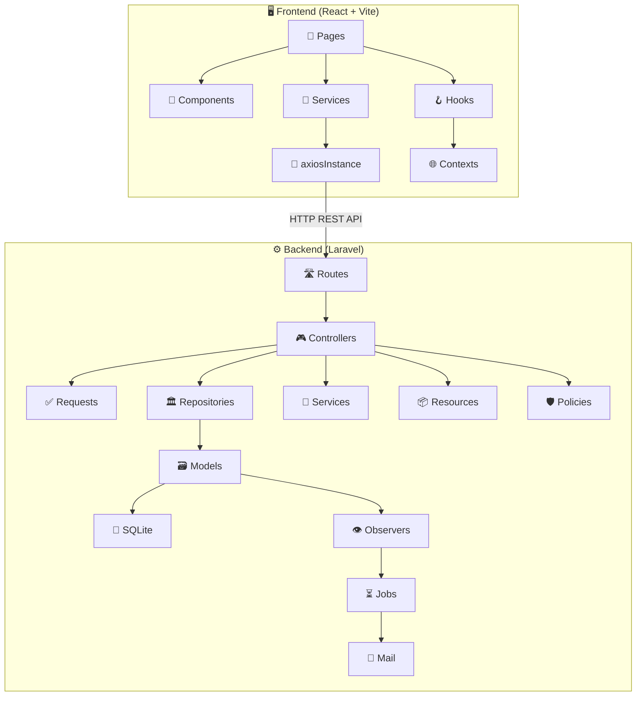
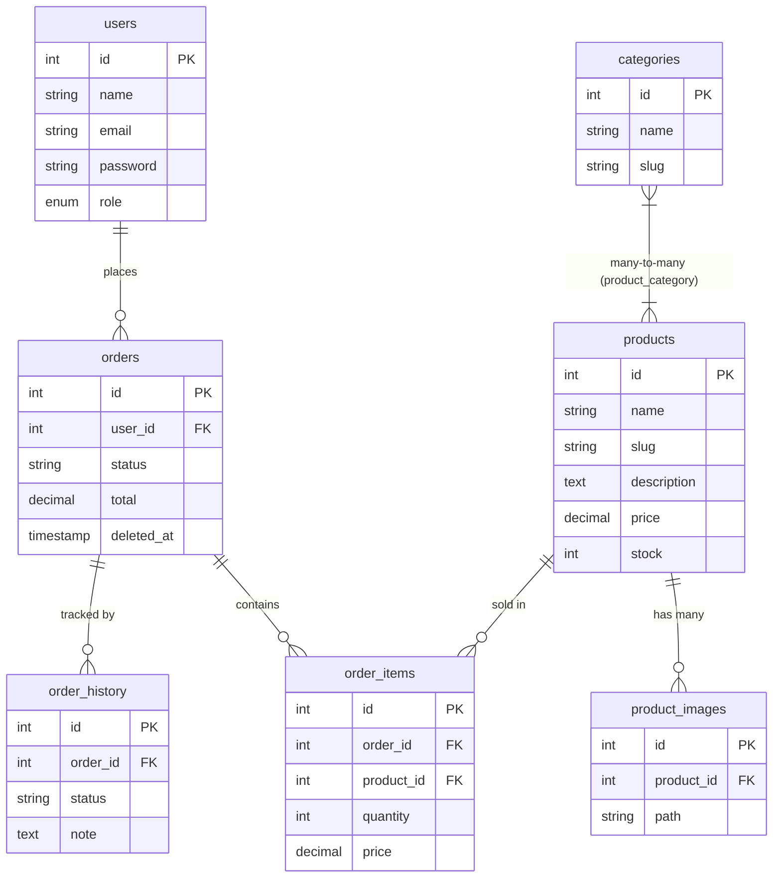

# 🗺️ Project Map — BTLon

> **Last updated:** 2026-06-11
> **Tech Stack:** React (Vite) + Laravel API + SQLite
> **Architecture:** SPA Frontend ↔ RESTful API Backend (Repository Pattern)

---

## 📁 Tổng quan cấu trúc thư mục gốc

```
BTLon/
├── BTLonFE/              # 🖥️ Frontend — React + Vite
├── apiBTLon/             # ⚙️ Backend  — Laravel API
├── L_up_obsidian/        # 📝 Tài liệu & ghi chú (Obsidian)
└── learned/              # 📚 Tài liệu học tập
```

---

## 🖥️ Frontend — `BTLonFE/`

> **Framework:** React (JSX) · **Bundler:** Vite · **HTTP Client:** Axios
> **CSS:** Tailwind CSS (qua CDN hoặc config)

### Cấu trúc tổng quan

```
BTLonFE/
├── index.html
├── vite.config.js
├── package.json
├── .env
├── public/
└── src/
    ├── App.jsx                    # Root component
    ├── main.jsx                   # Entry point (ReactDOM, Providers)
    ├── index.css                  # Global styles
    │
    ├── api/                       # 🔌 HTTP layer
    │   └── axiosInstance.js        #   Axios config (baseURL, interceptors)
    │
    ├── config/                    # ⚙️ App configuration
    │   └── app.js                 #   App-level settings
    │
    ├── contexts/                  # 🌐 React Context (Global State)
    │   ├── AuthContext.js          #   Auth context definition
    │   ├── AuthProvider.jsx        #   Auth state provider
    │   ├── CartContext.js          #   Cart context definition
    │   ├── CartProvider.jsx        #   Cart state provider
    │   └── ToastContext.js         #   Toast notification context
    │
    ├── hooks/                     # 🪝 Custom Hooks
    │   ├── useApiCall.js           #   API call wrapper (loading, error)
    │   ├── useAuth.js              #   Auth utilities hook
    │   ├── useCart.js              #   Cart operations hook
    │   ├── useDebounce.js          #   Debounce input hook
    │   ├── useFadeIn.js            #   Fade-in animation hook
    │   ├── usePagination.js        #   Pagination logic hook
    │   └── useToast.js             #   Toast notification hook
    │
    ├── services/                  # 📡 API Service Layer
    │   ├── authService.js          #   Login, logout, register
    │   ├── cartService.js          #   Cart CRUD operations
    │   ├── categoryService.js      #   Category CRUD
    │   ├── dashboardService.js     #   Dashboard statistics
    │   ├── orderService.js         #   Order management
    │   └── productService.js       #   Product CRUD
    │
    ├── router/                    # 🧭 Routing
    │   ├── index.jsx               #   Route definitions (React Router)
    │   └── ProtectedRoute.jsx      #   Auth guard component
    │
    ├── layouts/                   # 📐 Layout Components
    │   ├── AdminLayout.jsx         #   Admin dashboard layout (sidebar + topbar)
    │   └── GuestLayout.jsx         #   Public-facing layout (header + footer)
    │
    ├── components/                # 🧩 Reusable Components
    │   ├── admin/                  #   ── Admin-specific ──
    │   │   ├── Sidebar.jsx         #     Admin sidebar navigation
    │   │   └── Topbar.jsx          #     Admin top bar
    │   │
    │   ├── guest/                  #   ── Guest/Public ──
    │   │   ├── Header.jsx          #     Main navigation header
    │   │   ├── Footer.jsx          #     Site footer
    │   │   ├── ProductCard.jsx     #     Product display card
    │   │   ├── ProductSkeleton.jsx #     Loading skeleton
    │   │   ├── CategoryCard.jsx    #     Category display card
    │   │   ├── SectionHeader.jsx   #     Section title component
    │   │   ├── FadeSection.jsx     #     Fade-in section wrapper
    │   │   ├── CheckoutForm.jsx    #     Checkout form fields
    │   │   ├── OrderSummary.jsx    #     Order summary display
    │   │   └── PaymentMethod.jsx   #     Payment method selector
    │   │
    │   ├── common/                 #   ── Shared/Common ──
    │   │   ├── Modal.jsx           #     Reusable modal dialog
    │   │   ├── Spinner.jsx         #     Loading spinner
    │   │   └── Loadingoverlay.jsx  #     Full-screen loading overlay
    │   │
    │   └── ui/                     #   ── UI Primitives ──
    │       ├── Badge.jsx           #     Status badge
    │       ├── Button.jsx          #     Button variants
    │       ├── Emptystate.jsx      #     Empty state placeholder
    │       ├── Input.jsx           #     Form input component
    │       ├── Pagination.jsx      #     Pagination controls
    │       └── Toast.jsx           #     Toast notification
    │
    ├── pages/                     # 📄 Page Components
    │   ├── NotFound.jsx            #   404 page
    │   │
    │   ├── admin/                  #   ── Admin Pages ──
    │   │   └── Login.jsx           #     Admin login page
    │   │
    │   └── guest/                  #   ── Guest Pages ──
    │       ├── Home.jsx            #     Homepage (hero, products, categories)
    │       ├── Product.jsx         #     Product listing / detail page
    │       ├── Cart.jsx            #     Shopping cart page
    │       ├── Checkout.jsx        #     Checkout page
    │       ├── OrderSuccess.jsx    #     Order success confirmation
    │       └── TrackOrder.jsx      #     Order tracking page
    │
    ├── utils/                     # 🛠️ Utilities
    │   └── helpers/
    │       ├── formatPrice.js      #     Price formatting (VNĐ)
    │       └── downloadFile.js     #     File download helper
    │
    └── assets/                    # 🎨 Static Assets (empty)
```

---

## ⚙️ Backend — `apiBTLon/`

> **Framework:** Laravel 11 · **Auth:** Sanctum · **DB:** SQLite
> **Pattern:** Repository Pattern (Interface → Implementation → Service → Controller)

### Cấu trúc tổng quan

```
apiBTLon/
├── artisan
├── composer.json
├── .env / .env.example
├── vite.config.js
├── phpunit.xml
│
├── app/
│   ├── Enums/                         # 📋 Enumerations
│   │   ├── OrderStatus.php             #   Trạng thái đơn hàng
│   │   └── UserRole.php                #   Vai trò người dùng
│   │
│   ├── Http/
│   │   ├── Controllers/               # 🎮 Controllers
│   │   │   ├── Base/
│   │   │   │   └── BaseController.php  #     Base controller
│   │   │   ├── Controller.php          #     Laravel base
│   │   │   ├── AuthController.php      #     Đăng nhập / Đăng xuất
│   │   │   ├── CategoryController.php  #     CRUD Categories
│   │   │   ├── ProductController.php   #     CRUD Products
│   │   │   ├── OrderController.php     #     Quản lý đơn hàng
│   │   │   └── DashboardController.php #     Thống kê dashboard
│   │   │
│   │   ├── Requests/                  # ✅ Form Requests (Validation)
│   │   │   ├── LoginRequest.php
│   │   │   ├── CategoryCreateRequest.php
│   │   │   ├── CategoryUpdateRequest.php
│   │   │   ├── CategoryIndexRequest.php
│   │   │   ├── ProductCreateRequest.php
│   │   │   ├── ProductUpdateRequest.php
│   │   │   ├── ProductIndexRequest.php
│   │   │   ├── UploadProductImagesRequest.php
│   │   │   ├── StoreOrderRequest.php
│   │   │   ├── UpdateOrderRequest.php
│   │   │   ├── OrderIndexRequest.php
│   │   │   ├── OrderExportRequest.php
│   │   │   ├── ComfirmCancelOrderRequest.php
│   │   │   └── GuestCancelOrderRequest.php
│   │   │
│   │   └── Resources/                # 📦 API Resources (JSON Transform)
│   │       ├── CategoryResource.php
│   │       ├── ProductResource.php
│   │       ├── ProductImageResource.php
│   │       ├── OrderResource.php
│   │       ├── OrderItemResource.php
│   │       └── UserResource.php
│   │
│   ├── Models/                        # 🗃️ Eloquent Models
│   │   ├── User.php
│   │   ├── Category.php
│   │   ├── Product.php
│   │   ├── ProductImage.php
│   │   ├── Order.php
│   │   ├── OrderItem.php
│   │   └── OrderHistory.php
│   │
│   ├── Repositories/                  # 🏛️ Repository Layer
│   │   ├── Base/
│   │   │   ├── EloquentRepositoryInterface.php
│   │   │   └── EloquentRepository.php
│   │   ├── Interfaces/
│   │   │   ├── CategoryRepositoryInterface.php
│   │   │   ├── ProductRepositoryInterface.php
│   │   │   ├── OrderRepositoryInterface.php
│   │   │   └── DashboardRepositoryInterface.php
│   │   ├── CategoryRepository.php
│   │   ├── ProductRepository.php
│   │   ├── OrderRepository.php
│   │   └── DashboardRepository.php
│   │
│   ├── Services/                      # 🔧 Business Logic Services
│   │   ├── DashboardService.php        #   Thống kê, báo cáo
│   │   ├── FileService.php             #   Upload/quản lý file
│   │   ├── OrderService.php            #   Xử lý đơn hàng, inventory
│   │   └── ProductImageService.php     #   Xử lý ảnh sản phẩm
│   │
│   ├── Observers/                     # 👁️ Model Observers
│   │   ├── OrderObserver.php           #   Theo dõi thay đổi đơn hàng
│   │   └── ProductObserver.php         #   Theo dõi thay đổi sản phẩm
│   │
│   ├── Jobs/                          # ⏳ Queue Jobs
│   │   └── SendLowStockNotificationJob.php  # Cảnh báo hết hàng
│   │
│   ├── Mail/                          # 📧 Mailables
│   │   ├── ConfirmOrderCheckout.php    #   Email xác nhận đơn hàng
│   │   └── GuestCancelOrderMail.php    #   Email huỷ đơn (guest)
│   │
│   ├── Notifications/                 # 🔔 Notifications
│   │   └── LowStockNotification.php    #   Thông báo tồn kho thấp
│   │
│   ├── Policies/                      # 🛡️ Authorization Policies
│   │   ├── CategoryPolicy.php
│   │   └── ProductPolicy.php
│   │
│   ├── Providers/                     # 🔌 Service Providers
│   │   ├── AppServiceProvider.php      #   Boot observers, configs
│   │   └── RepositoryServiceProvider.php # Bind interfaces → implementations
│   │
│   └── Trait/                         # 🧬 Traits
│       ├── ApiResponser.php            #   Standardized API responses
│       └── HasCustomSlug.php           #   Auto-generate slugs
│
├── config/                            # ⚙️ Configuration Files
│   ├── app.php
│   ├── auth.php
│   ├── cache.php
│   ├── database.php
│   ├── filesystems.php
│   ├── image.php
│   ├── inventory.php                   #   Cấu hình tồn kho
│   ├── logging.php
│   ├── mail.php
│   ├── queue.php
│   ├── sanctum.php
│   ├── services.php
│   └── session.php
│
├── database/
│   ├── database.sqlite                # 💾 SQLite database file
│   ├── migrations/                    # 📋 Database Migrations
│   │   ├── create_users_table
│   │   ├── create_cache_table
│   │   ├── create_jobs_table
│   │   ├── create_personal_access_tokens_table
│   │   ├── add_fields_to_users_table
│   │   ├── create_categories_table
│   │   ├── create_products_table
│   │   ├── create_product_category_table  # (many-to-many pivot)
│   │   ├── create_product_images_table
│   │   ├── create_orders_table
│   │   ├── create_order_items_table
│   │   ├── create_order_history_table
│   │   ├── add_field_to_orders_table
│   │   ├── add_column_to_product_images_table
│   │   ├── create_notifications_table
│   │   └── add_deleted_at_field_to_orders
│   ├── seeders/
│   │   └── DatabaseSeeder.php
│   └── factories/
│       └── UserFactory.php
│
├── routes/                            # 🛣️ API Routes
│   ├── api.php                         #   Tất cả API endpoints
│   ├── web.php                         #   Web routes (minimal)
│   └── console.php                     #   Console commands
│
├── resources/
│   └── views/
│       └── welcome.blade.php
│
├── storage/                           # 📂 File storage
├── tests/                             # 🧪 Tests
├── bootstrap/                         # 🚀 Framework bootstrap
└── vendor/                            # 📦 Composer dependencies
```

---

## 📊 Sơ đồ kiến trúc



---

## 🔄 Data Flow

```
User Action (Click, Submit)
  → Page Component
    → Service (API call)
      → axiosInstance (headers, token)
        → Laravel API Route
          → Controller (validate via FormRequest)
            → Repository (query DB)
              → Model (Eloquent)
                → SQLite
            → Service (business logic)
          → Resource (format JSON)
        → Axios Response
      → Hook (update state)
    → Re-render UI
```

---

## 🗄️ Database Schema (Entity Relationships)



---

## 📝 Tài liệu — `L_up_obsidian/`

| File | Mô tả |
|------|--------|
| `Welcome Luc this is your task.md` | Giới thiệu & nhiệm vụ |
| `Target.md` | Mục tiêu dự án |
| `Creating Base.md` | Hướng dẫn tạo nền tảng |
| `Implementing BE Feature.md` | Quy trình implement tính năng BE |
| `UI Plan.md` | Kế hoạch giao diện UI |
| `Diagram.md` | Sơ đồ |
| `Project Map.md` | 📍 File này |

---

## 📚 Tài liệu học tập — `learned/`

| File | Nội dung |
|------|----------|
| `html-comprehensive.md` | Tổng hợp HTML |
| `css-comprehensive.md` | Tổng hợp CSS |
| `tailwind-comprehensive.md` | Tổng hợp Tailwind CSS |
| `laravel-comprehensive.md` | Tổng hợp Laravel |
| `leaned.md` | Ghi chú học tập tổng hợp |

---

## 🔑 Key Patterns & Conventions

### Backend (Laravel)
- **Repository Pattern**: Interface → Implementation → bind trong `RepositoryServiceProvider`
- **API Response**: Sử dụng `ApiResponser` trait cho response format thống nhất
- **Validation**: Mỗi action có riêng `FormRequest` class
- **Resource Transformation**: Dùng `JsonResource` cho API output
- **Observer Pattern**: `OrderObserver`, `ProductObserver` cho side effects
- **Queue Jobs**: Background processing cho notifications (low stock)
- **Auth**: Laravel Sanctum (token-based)

### Frontend (React)
- **Context + Hooks**: Global state qua `AuthProvider`, `CartProvider`
- **Service Layer**: Tách API calls vào `/services` thay vì gọi trực tiếp trong components
- **Custom Hooks**: Reusable logic (`useApiCall`, `usePagination`, `useDebounce`...)
- **Component Organization**: Tách theo role (`admin/`, `guest/`, `common/`, `ui/`)
- **Protected Routes**: `ProtectedRoute` component cho admin pages
- **Layout System**: `AdminLayout` và `GuestLayout` wrap pages
