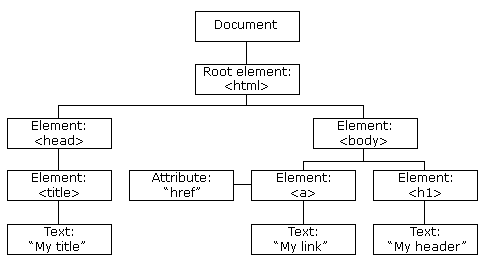
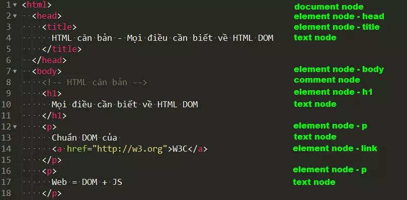
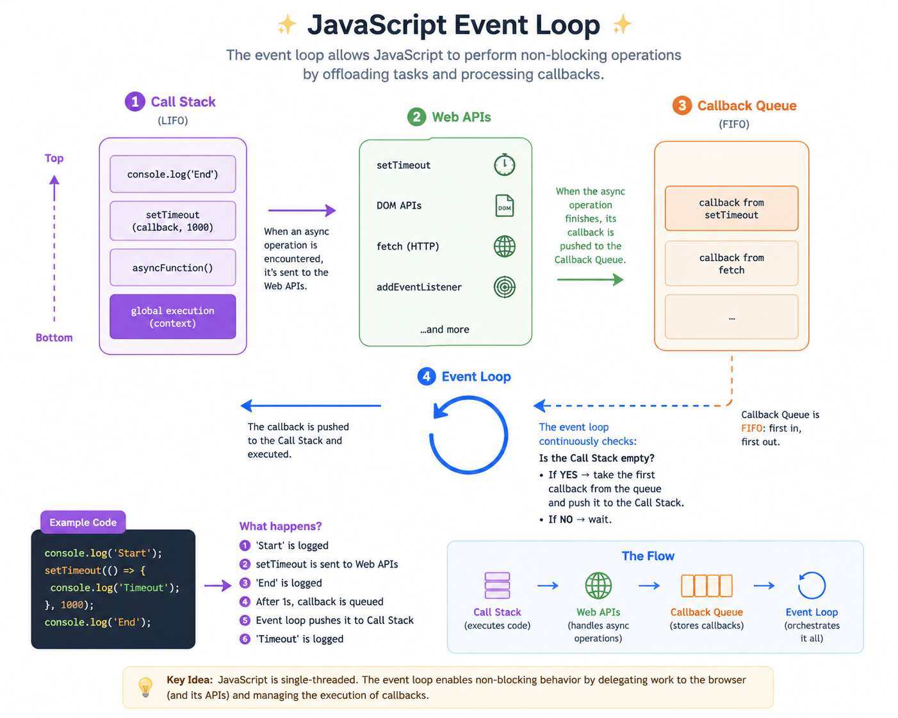
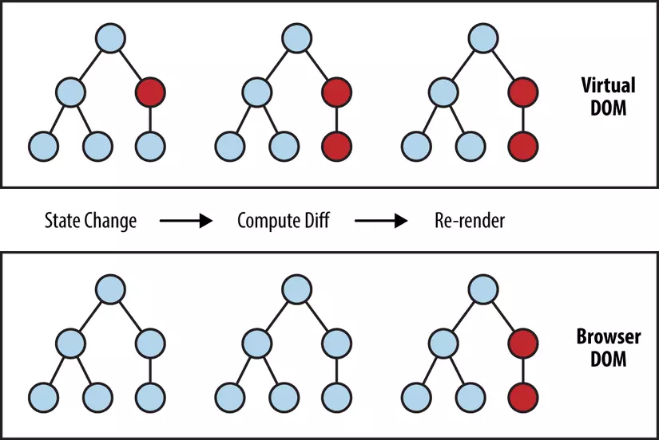

# HTML (HyperText Markup Language)

**HTML** Là ngôn ngữ đánh dấu dùng để mô tả cấu trúc nội dung của trang web. Trình duyệt đọc HTML để hiển thị văn bản, hình ảnh, form, video, liên kết, v.v

_**Note**_:

- Quy chuẩn viết code HTML nên tuân theo chuẩn của W3C (World Wide Web Consortium) đưa ra.
- Phiên bản sử dụng là: v5.x

---

## 1.1. Element

**Element** là đơn vị cơ bản của HTML, mỗi phần tử được trình duyệt hiểu và hiển thị dựa trên các thẻ đánh dấu.

_**Ví dụ**_: `<p>hello</p>`

- `<p>`: opening tag
- `</p>`: closing tag
- Hello World: content

Một element gồm `<tagname>content</tagname>`
_**Note**_: Một số loại thẻ sẽ không có closing tag.

---

## 1.2. Tag

**Tag** dùng để định nghĩa loại phần tử.

_**Ví dụ**_:

- `<h1>Tiêu đề</h1>`
- `<a href="https://example.com">Link</a>`
  | Tag | Ý nghĩa |
  | ----------- | ---------------- |
  | `h1` → `h6` | heading |
  | `p` | paragraph |
  | `a` | link |
  | `img` | image |
  | `div` | block container |
  | `span` | inline container |
  | `form` | biểu mẫu |
  | `input` | ô nhập liệu |
  | `button` | nút |

## 1.3. Attribute

**Attribute** là các thuộc tính bổ sung cho element, một element có thể có nhiều attribute.

_**Ví dụ**_:

- `<a href="https://google.com" class="atag">Google</a>`
- href là attribute
- giá trị: "https://google.com"

Cú pháp: data-\* (Ví dụ: data-id="123", data-role="admin").

Ứng dụng: Rất hay dùng khi kết hợp với JavaScript để lấy dữ liệu từ giao diện mà không làm ảnh hưởng đến cấu trúc HTML.

---

## 1.4. Nested Elements

**Nested Elements** nghĩa là một element có thể chứa 1 element khác.

_**Ví dụ**_:

```
 <div>
   <h1>Title</h1>
 </div>
```

---

## 1.5. HTML DOM (HTML Document Object Model)

**DOM** là interface dạng object tree để quản lý các đối tượng.

Trình duyệt tạo thành cấu trúc dạng cây (DOM tree), gồm 3 thành phần chính của cây:

- Element
- Attribute
- Content

```
<body>
  <div>
    <p>Hello</p>
  </div>
</body>
```



```
Document
 └── html
      └── body
           └── p
                └── "Hello"
```

Đối với HTML DOM cấu trúc dạng cây gọi là DOM Tree có nghĩa là mọi thành phần đều được xem là 1 node, được biểu diễn trên 1 cây. Các phần tử khác nhau sẽ được phân loại node khác nhau nhưng quan trọng nhất là 3 loại:

- Root node: Thường được biểu diễn bởi `<html>` là thành phần của HTML.
- Element node: Biểu thị cho 1 phần tử HTML.
- Content node(Text node): mỗi đoạn ký tự trong document HTML, content trên trong element đều là 1 text node.



---

## 1.6. Block and Inline Elements

### 1.6.1 Block Elements

**Block Elements** là một element chiếm toàn bộ chiều ngang.

_**Ví dụ**_:

```
<div></div>
<p></p>
<h1></h1>
```

### 1.6.2 Inline Elements

**Inline Elements** chỉ chiếm kích thước bằng đúng nội dung.

_**Ví dụ**_:

```
<span></span>
<a></a>
<strong></strong>
```

_**Note**_:

- Một Block element có thể chứa các Block element khác và các Inline element. Nhưng một Inline element thì KHÔNG được chứa Block element bên trong nó.

- Ngoại lệ duy nhất: Trong HTML5, thẻ `<a>` (Inline) được phép bao bọc một thẻ `<div>` (Block) để biến toàn bộ khối đó thành một liên kết.

---

## 1.7. Senematic HTML

Dùng tag mang ý nghĩa rõ ràng thay vì chỉ layout.

_**Ví dụ**_:

```
<header>
<nav>
<main>
<article>
<section>
<footer>
```

sử dụng các thẻ Senematic sẽ tối ưu tốt cho SEO hơn là chỉ dùng các thẻ `<div class="layout"><div>`

---

## 1.8. HTML Document Structure

Một **HTML Document** là một tài liệu văn bản có cấu trúc, dùng các thẻ (tags) lồng nhau để mô tả nội dung và cấu trúc của trang web. Trình duyệt sẽ parse tài liệu này, xây dựng DOM tree, rồi render giao diện hiển thị cho người dùng.

```
<!DOCTYPE html>
<html lang="en">
<head>
    <meta charset="UTF-8">
    <meta name="viewport" content="width=device-width, initial-scale=1.0">
    <title>Page Title</title>
</head>
<body>
    <h1>Welcome to My Website</h1>
    <p>This is where the content goes.</p>
</body>
</html>
```

| Thành phần | Vai trò           |
| ---------- | ----------------- |
| `DOCTYPE`  | khai báo HTML5    |
| `html`     | root element      |
| `head`     | metadata          |
| `body`     | nội dung hiển thị |

---

## 1.9. Metadata

**Metadata** sẽ không được hiển thị trực tiếp trên giao diện trình duyệt người dùng để đọc, nó đóng vai trò cung cấp thông tin thêm cho trình duyệt và các công cụ tìm kiếm (SEO) và các dịch vụ web khác.

_**Note**_: Các metadata thường nằm gọn bên trong thẻ `<head>` của HTML.

_**Ví dụ**_:

```
<meta charset="UTF-8">
<meta name="viewport" content="width=device-width, initial-scale=1.0">
```

---

## 1.10. Form

**Form** là cầu nối để thu thập dữ liệu của người dùng và gửi dữ liệu đó về máy chủ để xử lý.

```
<form action="/xu-ly-don-hang" method="POST">
  <input type="text">
  <button>Submit</button>
</form>
```

Trong đó có 2 thuộc tính (Attributes) quan trọng nhất:

- action: Đường dẫn (URL) nơi dữ liệu sẽ được gửi đến trên server để xử lý.

- method: Phương thức gửi dữ liệu. Có 2 loại phổ biến:
  - GET: Gửi dữ liệu công khai trên thanh địa chỉ URL (thường dùng cho tìm kiếm).
  - POST: Gửi dữ liệu ẩn, bảo mật hơn (thường dùng cho đăng ký, đăng nhập, thanh toán).

**Input** là các ô nhập liệu thường input nằm trong form sẽ dùng để lấy dữ liệu.

_**Ví dụ**_:
`<input type="text">`

Validation:

- required: Bắt buộc phải điền thông tin.
- placeholder: Hiển thị văn bản gợi ý mờ bên trong ô nhập liệu.
- readonly / disabled: Chỉ cho xem chứ không cho chỉnh sửa / Vô hiệu hóa ô nhập liệu.

type:

- text: Ô nhập văn bản ngắn (Họ tên, địa chỉ...).
- password: Ô nhập mật khẩu (ký tự sẽ tự động biến thành dấu chấm ●●●●).
- email: Ô nhập email (tự động kiểm tra xem người dùng có nhập đúng định dạng @ hay không).
- number: kiểu số.
- checkbox: Hộp kiểm cho phép chọn nhiều lựa chọn cùng lúc (ví dụ: Chọn các sở thích).
- radio: Nút chọn một trong nhiều (ví dụ: Chọn Giới tính: Nam hoặc Nữ).
- file: Nút nhấn chọn file
- date: Chọn date (ví dụ: "2018-07-22")
- submit: Nút để gửi toàn bộ dữ liệu trong form đi.

---

## 1.11. Media Elements

Các loại elements liên quan đến đa phương tiện.

**Image**

``

Luôn luôn phải có alt. Nếu ảnh bị lỗi không tải được, chữ trong alt sẽ hiển thị thay thế.

**Video**

```
<video controls>
  <source src="movie.mp4">
</video>
```

**Audio**

```
<audio controls>
  <source src="song.mp3">
</audio>
```

---

## 1.12. Link and Navigation

**Link and Navigation** Giúp chúng ta kết nối các trang web với nhau dẫn dắt người dùng di chuyển từ nội dung này sang nội dung khác.

_**Ví dụ**_: `<a href="https://wikipedia.org">Wikipedia</a>`

Các loại liên kết phổ biến:

- internal links: Dẫn đến một trang khác nằm ngay trong cùng website của bạn.
- external links: Dẫn đến một trang web hoàn chỉnh bên ngoài (phải có http:// hoặc https://).
- anchor links: Dẫn người dùng nhảy đến một vị trí cụ thể trên cùng một trang (sử dụng #ID).

---

## 1.13. Tables

**Tables (Bảng)** sử dụng để hiển thị dữ liệu dưới dạng lưới (gồm các hàng và các cột)
Cấu trúc cơ bản:

- Hàng (Row): Tập hợp các ô dữ liệu nằm ngang, đại diện cho một đối tượng hoặc một bản ghi.
- Cột (Column): Tập hợp các ô dữ liệu nằm dọc, đại diện cho một thuộc tính hoặc một danh mục.
- Tiêu đề (Header): Ô nằm trên cùng của cột (hoặc đầu hàng) giúp định danh cho loại dữ liệu bên dưới.

_**Ví dụ**_:

```
<table>
  <tr>
    <th>Name</th>
    <th>Age</th>
  </tr>
  <tr>
    <td>John</td>
    <td>20</td>
  </tr>
</table>
```

---

# CSS (Cascading Style Sheets)

**CSS (Cascading Style Sheets)** là ngôn ngữ dùng để định dạng và tạo kiểu dáng cho phần tử được viết bằng ngôn ngữ đánh dấu (HTML).
CSS chịu trách nhiệm về diện mạo, bố cục, màu sắc, phông chữ và khả năng hiển thị tương thích trên nhiều web khác nhau. Tưởng tượng nếu HTML là khung xương thì CSS là da thịt.


## 2.1. Syntax & Selectors

### 2.1.1. Syntax

Một CSS Rule bao gồm hai thành phần chính: Selector và Declaration Block (Khối khai báo)

```
selector {
  property: value; /* Một khai báo (declaration) */
}
```

- Selector: chỉ định phần từ nào sẽ được áp dụng định dạng.
- Property (Thuộc tính): Chứa các thuộc tính cần thay đổi như color, font-size.
- Value: Giá trị gán cho thuộc tính đó như color: red, thì red là value của property color

**Basic selector:**

- Universal Selector (\*): Chọn tất cả phần tử trên trang.
- Type Selector (Element Selector): Chọn theo tên thẻ HTML (ví dụ `<p>, <h1>, <div>`).
- Class Selector (.className): Chọn các phần tử có thuộc tính class="...". Có thể sử dụng cho nhiều phần tử có trùng tên class.
- ID Selector (#idName): Chọn phần tử duy nhất có thuộc tính id="...". Mỗi ID chỉ được xuất hiện một lần duy nhất trên trang.

**Combinators**

Dùng để chọn phần tử dựa trên mối quan hệ gia phả trong cây DOM.

- Decendant Selector: Chọn tất cả con, cháu, nhỏ hơn nữa,... nằm trong phần tử cha.

  ```
  div p { /* Chọn tất cả các thẻ P nằm trong div, bất kể sâu bao nhiêu */
    color: blue;
  }
  ```

- Child Selector (>): Chỉ chọn những phần tử con trực tiếp F0>F1 của phần tử cha.

  ```
  div > p { /* chỉ chọn những phần tử là con trực tiếp của div */
    color: red;
  }
  ```

- Adjacent Sibling Selector (+): Chọn phần tử anh/em nằm ngay sát phía sau cùng cấp với phần tử trước đó.

  ```
  h1 + p {
    margin-top: 0; /* chỉ chọn thẻ p nằm ngay sau h1 */
  }
  ```

- General Sibling Selector (~): chọn tất cả các phần tử anh/em nằm phía sau cùng cấp không nhất thiết phải sát nhau.
  ```
  h1 ~ p {
    color: gray; /* chọn tất cả thẻ p đồng cấp nằm ngay sau h1 */
  }
  ```

**Attribute Selectors**

Chọn phần tử dựa trên sự hiện diện hoặc giá trị của thuộc tính HTML.

- `[attr]`: có thuộc tính `attr`.

  _**Ví dụ**_:
  - HTML: `<input type="text"><input>`
  - CSS: `[type] { border: 1px solid red;}`

- `[attr="value"]`: Giá trị thuộc tính chính xác `value`
- `[attr^="value"]`: Giá trị thuộc tính bắt đầu bằng `value`
- `[attr$="value"]`: Giá trị thuộc tính kết thúc bằng `value`
- `[attr*="value"]`: Giá trị thuộc tính chứa chuỗi `value`

**Pseudo-classes**

Dùng để định dạn phần tử khi ở một trạng thái cụ thể hoặc dựa trên vị trí của chúng.

- Trạng thái tương tác:
  - `:hover` (di chuột qua).
  - `:active` (đang nhấn giữ).
  - `:forcus` (đang chọn/nhấp vào ô input).

- Trạng thái liên kết: :link (chưa truy cập), :visited (đã truy cập).

- Vị trí/Cấu trúc:
  - `:first-child`: Phần tử con đầu tiên của cha.
  - `:last-child`: Phần tử con cuối cùng của cha.
  - `:nth-child(n)`: Phần tử con thứ n của cha (có thể truyền odd - lẻ, even - chẵn, hoặc công thức 2n + 1).
  - `:not(selector)`: Loại trừ phần tử khớp với selector.

**Pseudo-elements**

Dùng để tạo kiểu cho một phần cụ thể của phần tử hoặc chèn thêm nội dung ảo bằng CSS.

- `::before`: Chèn nội dung vào ngay trước nội dung của phần tử (bắt buộc phải có thuộc tính `content`).
- `::after`: Chèn nội dung vào ngay sau nội dung của phần tử.
- `::first-letter`: Định dạng chữ cái đầu tiên của đoạn văn.
- `::placeholder`: Định dạng chữ gợi ý trong các thẻ `input`.

---

## 2.2. Cascade, Inheritance & Specificity (Tính kế thừa và Độ ưu tiên)

khi có nhiều CSS Rules cùng trỏ vào một phàn tử, trình duyệt sẽ dựa vào 3 nguyên lý để quyết định CSS Selector nào sẽ được áp dụng:

### 2.2.1. Cascade (Tính thác nước)

CSS đọc từ trên xuống dưới. Nếu hai bộ chọn có cùng độ ưu tiên, quy tắc nào được định nghĩa phía sau sẽ đè lên quy tắc định nghĩa trước.

### 2.2.2. Inheritance (Tính kế thừa)

Một số thuộc tính CSS được tự động truyền từ phần tử cha xuống các phần tử con bên trong nó (ví dụ: color, font-family, line-height). Tuy nhiên, một số thuộc tính khác thì không (ví dụ: border, margin, padding).

### 2.2.3. Specificity (Độ ưu tiên)

Trình duyệt tính toán độ ưu tiên của một selector dựa trên trọng số. Selector nào có trọng số cao hơn sẽ được áp dụng.

Công thức tính độ ưu tiên dựa trên bộ bốn giá trị (a, b, c, d):

1. (a) Inline Styles: Viết trực tiếp trong thuộc tính style="..." của thẻ HTML -> +1000.
2. (b) ID Selectors: Sử dụng #id -> +100.
3. (c) Class, Pseudo-classes, Attributes: Sử dụng .class, :hover, `[type="text]` -> +10
4. (d) Elements, Pseudo-elements: Sử dụng div, p, ::before -> +1.

$$Specificity = a \times 1000 + b \times 100 + c \times 10 + d$$

- Từ khóa `!important`: khi được đặt sau một giá trị thuộc tính (ví dụ: `color: red !important;`), nó sẽ phá vớ mọi quy tắc tính trọng số trên và cưỡng chế áp dụng giá trị đó.

_**Note**_: Chỉ dùng khi cực kỳ cần thiết, lạm dụng sẽ làm hỏng toàn bộ cấu trúc CSS.

---

## 2.3. Các cách nhúng CSS và HTML

Có 3 cách để liên kết CSS với tài liệu HTML:

| Phương pháp                   | Cú pháp                                          | Ưu điểm                                                              | Nhược điểm                                                                    |
| ----------------------------- | ------------------------------------------------ | -------------------------------------------------------------------- | ----------------------------------------------------------------------------- |
| External CSS (Liên kết ngoài) | `<link rel="stylesheet" href="style.css">`       | Dễ bảo trì, tái sử dụng CSS cho nhiều trang, giúp code HTML sạch sẽ. | Cần thêm một yêu cầu mạng (HTTP request) để tải file CSS.                     |
| Internal CSS (Liên kết trong) | Viết trong thẻ `<style>` bên trong thẻ `<head>`. | Tiện lợi khi viết CSS riêng cho một trang duy nhất.                  | Làm tăng kích thước file HTML, không tái sử dụng được code.                   |
| Inline CSS (Trực tiếp)        | `<p style="color: red;">`                        | Độ ưu tiên cao, hữu ích khi cần can thiệp nhanh bằng JavaScript.     | Code khó bảo trì, dễ rối, vi phạm nguyên tắc tách biệt nội dung và giao diện. |

---

## 2.4. CSS Box Model (Mô hình hộp)

Mọi phần tử HTML hiển thị trên trang web đều được trình duyệt coi là một mô hình hộp - hình chữ nhật. Mô hình này gồm 4 lớp từ trong ra ngoài:

1. Content: Vùng hiển thị nội dung thực tế (văn bản, hình ảnh,...). Có kích thước được xác định với `width` và `height`.
2. Padding (Vùng đệm): Khoảng không gian trống nằm giữa nội dung và viền. Có màu nền giống màu Content.
3. Border (Viền): Đường viền bao quanh vùng đệm và nội dung.
4. Margin (Lề): Khoảng không gian trống bên ngoài viền để ngăn cách phần tử này với các phần tử khác. Margin có nền trogn suốt.

Thuộc tính `box-sizing`:

- `content-box` (mặc định): Kích thước thực tế hiển thị của phần tử sẽ lớn hơn thông số đã được khai báo.

$$\text{Tổng Width} = \text{width} + \text{left/right padding} + \text{left/right border}$$

- `border-box` (khuyên dùng): Kích thước thực tế sẽ bằng thông số khai báo. Trình duyệt sẽ tự co cụm vùng content để nhường lại chỗ cho padding và border.

$$\text{Tổng Width} = \text{Khai báo width (đã bao gồm Content + Padding + Border)}$$

---

## 2.5. Thuộc tính Display

Thuộc tính `display` xác định cách thức một phần tử hiển thị và sắp xếp trên trang web.

- `block`:
  - Chiếm toàn bộ chiều ngang có sẵn của phần tử cha (luôn tự động xuống dòng mới).
  - Có thể tùy chỉnh kích thước `width`, `height`, `margin`, `padding`.

- `inline`:
  - Chỉ chiếm vừa khít kích thước nội dung (nằm trên cùng một hàng với các phần tử inline khác).
  - Không thể set `width`, `height`.
  - `margin-top`, `margin-bottom` không hoạt động `padding` hoạt động nhưng không đẩy được các phần tử xung quanh ra xa được.

- `inline-block`:
  - Sự kết hợp: Xếp trên cùng một hàng như inline, nhưng lại có toàn bộ quyền chỉnh sửa kích thước `width`, `height`, `margin`, `padding` như `block`.

- `none`:
  - Ẩn hoàn toàn phần tử khỏi giao diện màn hình. Phần tử bị xóa khỏi luồng hiển thị (không chiếm lấy khoảng trống nào).
  - Khác biệt: `visibility: hidden` cũng ẩn phần tử nhưng giữ lại khoảng trống khung của phần tử đó trên trang.

---

## 2.6. CSS Positioning

Thuộc tính position kết hợp các thuộc tính định hướng top, bottom, left, right quyết định vị trí chính xác trên màn hình.

| Giá trị                | Hành vi định vị                                                                                                                                        | Điểm mốc để tính toán vị trí                                                                                                                                  |
| ---------------------- | ------------------------------------------------------------------------------------------------------------------------------------------------------ | ------------------------------------------------------------------------------------------------------------------------------------------------------------- |
| `static` (Mặc định)    | Nằm theo luồng tự nhiên của trang web từ trên xuống dưới, trái qua phải. Các thuộc tính `top`, `bottom`, `left`, `right` và `z-index` không hoạt động. | Không có mốc định vị riêng vì phần tử nằm hoàn toàn trong normal flow.                                                                                        |
| `relative` (Tương đối) | Di chuyển phần tử ra khỏi vị trí ban đầu của nó nhưng vẫn giữ lại khoảng trống nguyên bản không cho phần tử khác chiếm mất.                            | Mốc tính vị trí chính là vị trí tự nhiên ban đầu của chính nó.                                                                                                |
| `absolute` (Tuyệt đối) | Bị tách hoàn toàn khỏi luồng tự nhiên của trang web (không chiếm khoảng trống).                                                                        | Mốc tính vị trí là phần tử cha gần nhất có `position` khác `static` (thường cha được set `relative`). Nếu không có, mốc sẽ là phần tử `<html>` hoặc viewport. |
| `fixed` (Cố định)      | Bị tách khỏi luồng tự nhiên, nằm cố định một chỗ ngay cả khi người dùng cuộn trang. Thường dùng cho navbar, chatbot, floating button...                | Mốc tính vị trí luôn luôn là viewport (khung cửa sổ trình duyệt).                                                                                             |
| `sticky` (Dính)        | Hoạt động như `relative` khi cuộn bình thường, nhưng khi chạm tới mốc thiết lập (`top`, `left`...), nó sẽ chuyển sang trạng thái giống `fixed`.        | Mốc tính toán dựa trên vùng cuộn (scroll container) của phần tử cha trực tiếp của nó.                                                                         |

Thuộc tính `z-index`

- Chỉ hoạt động trên các phần tử posion khác static.
- Xác định thứ tự xếp chồng lên nhau của các lớp giao diện theo trục Z (Chiều sâu). Số lớn hơn sẽ nằm đè lên số nhỏ hơn.

---

## 2.7. Flexbox Layout

**Flexbox Layout** được thiết kế để phân bố không gian và căn chỉnh các phần tử con dọc theo một chiều duy nhất (hàng ngan hoặc cột dọc), cực ký linh hoạt ngay cả khi kích thước của chúng lớn hoặc động.

### 2.7.1. Thuộc tính dành cho container (thẻ cha)

Để kích hoạt, ta dùng: `display: flex;` hoặc `display: inline-flex;`.

- `flex-direction`: Xác định trục chính (Main Axis) của bố cục.
  - `row` (mặc định): Hàng ngang (từ trái qua phải).
  - `row-reverse`: Hàng ngang ngược (từ phải qua trái).
  - `column`: Cột dọc (trên xuống dưới).
  - `column-reverse`: Cột dọc ngược.

- `flex-wrap`: Quyết định xem phần tử có được xuống dòng hay không nếu vượt quá chiều rông của cha.
  - `nowrap` (mặc định): Ép tất cả con nằm trên một hàng.
  - `wrap`: Cho phép xuống dòng tự nhiên khi hết chỗ.

- `justify-content`: Căn chỉnh các phần tử con dọc theo Trục chính (Main Axis).
  - `flex-start` (mặc định): Dồn về đầu trục.
  - `flex-end`: Dồn về cuối trục.
  - `center`: Căn giữa.
  - `space-between`: Giãn đều, hai phần tử đầu và cuối bám sat viền cha.
  - `space-around`: Giãn đều, khoảng trống xung quanh mối phần tử bằng nhau (khoảng cách giữa 2 phần tử con gấp đôi khoảng cách với viền).
  - `space-evenly`: giãn đều tuyệt đối, mọi khoảng cách trống đều bằng nhau.

- `align-items`: Căn chỉnh các phần tử con dọc theo Trục phụ (Cross Axis) (vuông góc với trục chính).
  - `stretch` (mặc định): Kéo giãn các con cao bằng cha (nếu con không có set height cố định).
  - `flex-start`: Căn lên đầu trục phụ.
  - `flex-end`: Căn xuống đáy trục phụ
  - `center`: Căn giữa theo chiều dọc.
  - `baseline`: Căn giữa theo nội dung bên trong phần tử con.

- `gap`: Thiết lập khoảng cách trực tiếp giữa các phần tử con (Ví dụ: `gap: 20px;`) mà không cần dùng đến margin.

---

## 2.8. CSS Grid Layout

Khác với Flexbox chỉ chuyên trị một chiều, CSS Grid là hệ thống layout mạnh mẽ giúp quản lý bố cục đồng thời cả hai chiều (hàng ngang và cột dọc cùng lúc), tạo ra cấu trúc lưới vô cùng phức tạp.

### 2.8.1. Thuộc tính dành cho Grid Container (Khung cha)

Kích hoạt bằng: `display: grid;`.

- Grid template:
  - `grid-template-columns`: Định nghĩ số lượng và kích thước các cột dọc.
  - `grid-template-rows`: Định nghĩa số lượng và kích thước các hàng ngang.
  - Đơn vị đặc biệt `fr` (Fraction): Đại diện cho một phần không gian trống còn lại của lưới.
  - Hàm hỗ trợ: `repeat(số_lần, kích_thước)` giúp viết code ngắn gọn hơn

  ```
  /* Tạo lưới có 3 cột: cột 1 rộng 200px, 2 cột sau tự chia đều không gian còn lại */
  .grid-container {
    display: grid;
    grid-template-columns: 200px repeat(2, 1fr);
  }
  ```

- Khoảng cách :
  - `row-gap`: Khoảng cách giữa các hàng.
  - `column-gap`: Khoảng cách giữa các cột.
  - `gap` (viết tắt): khoảng cách chung giữa các hàng và các cột.

- `grid-template-areas`: Định nghĩa bố cục trực quan bằng cách đặt tên cho từng vùng lưới. Cực kỳ trực quan khi làm layout trang web.

  ```
  .grid-container {
    display: grid;
    grid-template-areas:
    "header header header"
    "sidebar content content"
    "footer footer footer";
  }
  ```

## 2.8.2. Thuộc tính dành cho Grid Items (Các phần tử con trực tiếp)

- Định vị thủ công:
  - `grid-column-start` / `grid-column-end`: Vạch bắt đầu và kết thúc của phần tử theo đường kẻ cột.
  - `grid-row-start` / `grid-row-end`: Vạch bắt đầu và kết thúc của phần tử theo đường kẻ hàng.
  - Cú pháp viết tắt: `grid-column: start / end;` hoặc sử dụng `span` để chỉ định số ô muốn chiếm.

  ```
  .main-banner {
    grid-column: 1 /span: 3; /* Chiếm từ đường kẻ 1 và trải rộng qua 3 ô cột */
  }
  ```

- `grid-area`: Đưa phần tử con vào vùng không gian đã được đặt tên ở phần `grid-template-areas` của cha.

  ```
  .header-component {
    grid-area: header;
  }
  ```

---

## 2.9. Đơn vị trong CSS (CSS Units)

Lựa chọn đơn vị đo lường phù hợp quyết định tính thích ứng (Responsive) của trang web trên các kích thước màn hình.

### 2.9.2. Đơn vị tuyệt đối (Absolute Units)

- `px` (Pixels): Kích thước cố định, không thay đổi dựa trên bất kỳ yếu tố nào khác. Rất tối để làm các đường viền nhỏ hoặc các khoảng cách cố định nhỏ, nhưng không tối ưu cho Responsive diện rộng.

### 2.9.3. Đơn vị tương đối (Relative Units)

- `%` (Percentage): Tỷ lệ phần trăm dựa trên kích thước của phần tử cha trực tiếp.

- `em`: Tương đối theo cỡ chữ (`font-size`) của chính phần tử đó hoặc phần tử cha gần nhất.
  - `em` có tính chất cộng dồn tầng lớp nên dễ gây ra các kích thước quá to hoặc nhỏ ngoài kiểm soát nếu lồng nhau quá nhiều.

- `rem` (Root EM): Tương dối duy nhát theo cỡ chữ của phần tử gốc (`<html>`). Mặc định trình duyệt thường đặt `1rem = 16px`.
  - _**Note**_: nên dùng `rem` cho cỡ chữ, padding, margin của toàn bộ dự án khi người dùng zoom trình duyệt hoặc đổi cỡ chữ hệt hống, trang web tự động co giẵn rất tốt.
- `vw` (Viewport Width): Tỷ lệ phần trăm theo chiều rộng toàn bộ khung cửa sổ trình duyệt (1vw = 1% chiều rộng màn hình).
- `vh` (Viewport Height): Tỷ lệ phần trăm theo chiều cao toàn bộ khung cửa sổ trình duyệt (1vh = 1% chiều cao màn hình).

---

## 2.10. Màu sắc & Kiểu chữ (Color & Typography)

### 2.10.1, Định nghĩa màu sắc trong CSS

- Màu theo tên: `red`, `blue`, `transparent`.
- Mã màu Hexadecimal (#RRGGBB): Hệ cơ số 16 (ví dụ: #ff0000 là đỏ, #ffffff là trắng, #000000 là đen).
- Hệ màu RGB/RGBA (`rgb(r, g, b, [a])`): ĐỊnh lượng Đỏ (Red), Xanh lá (Green), Xanh dương (Blue) từ 0 -> 255. Tham số `a` (alpha) quyết định độ trong suốt từ 0 (hoàn toàn trong suốt) đến 1 (đậm đặc).

  ```
  .overlay {
    background-color: rgba(0,0,0,0.5); /* nền đen với độ trong suốt 50% */
  }
  ```

- Hệ màu HSL/HSLA (`hsl(h , s, l, [a])`): Dựa trên góc màu (Hue: 0 -> 360), độ bão hòa màu (Saturation: 0% -> 100%) và độ sáng tối (Lightness: 0% -> 100%). Rất trực quan khi cần chỉnh sửa tông màu thủ công.

### 2.10.2. Các thuộc tính Typography cốt lõi

- `font-family`: Định nghĩa phông chữ sử dụng. Nên kết thúc bằng một phông dự phòng hệ thống (ví dụ:` front-family: 'Roboto', Arial, sans-serif;`).

- `font-size`: Cỡ chữ (khuyến khích dùng đơn vị rem).
- `font-weight`: Độ đặm nhạt của chữ (từ 100 mảnh nhất đến 900 đậm nhất; hoặc dùng normal, bold).
- `line-height`: Chiều cao của một dòng chữ (khoảng giãn dòng). Nên dùng số không kèm đơn vị (ví dụ: `line-height: 1.5;` tức bằng 1.5 lần cỡ chữ hiện tại) để đảm bảo tự co giãn tốt.
- `text-align`: căn lề văn bản (left, right, center, justify - căn đều 2 bên).
- `text-transform`: Chuyển đổi định dạng chữ (`uppercase` - IN HOA, `lowercase` - in thường, `capitalize` - Viết Hoa Chữ Cái Đầu).

---

## 2.11. Hiệu ứng động (Transitions, Transforms & Animations)

### 2.11.1 Transitions (Chuyển cảnh mượt mà)

Giúp thay đổi các giá trị thuộc tính CSS một cách mượt mà từ từ thay vì đột ngột thay đổi ngay lập tức.

```
.button {
  background-color: blue;
  /* Thuộc tính cần chuyển, Thời gian, Đường cong tốc độ, Thời gian chờ */
  transition: background-color 0.3s ease-in-out;
}
.button:hover {
  background-color: red; /* Khi rê chuột vào, nền sẽ chuyển từ xanh sang đỏ trong 0.3 giây */
}
```

- Các timing function phổ biến: `linear` (đều đều), `ease` (nhanh ở giữa), `ease-in` (chạm lúc đầu), `ease-out` (chậm lúc cuối), `cubic-bezier(x1, y1, x2, y2)` (tự định nghĩa đồ thị chuyển động).

### 2.11.2. Transforms (Biến hình)

Cho phép bạn dịch chuyển, xoay, thu phóng hoặc nghiên phần tử trong không gian 2D hoặc 3D.

- `translate(x, y)`: Dịch chuyển tọa độ phần tử theo trục ngang X và trục dọc Y.
  - Ứng dụng căn giữa kết hợp `absolute`:
  ```
  .child {
    position: absolute;
    top: 50%; left: 50%;
    transform: translate(-50%, -50%); /* Tự lùi lại đúng 50% kích thước bản thân */
  }
  ```
- `scale(x, y)`: Thu phóng phần tử (ví dụ: `scale(1.2)` phóng to lên gấp 1.2 lần).
- `rotate(angle)`: Xoay phần tử theo góc (ví dụ: `rotate(45deg)` xoay xuôi chiều kim đồng hồ 45 độ).
- `skew(x-angle, y-angle)`: Làm nghiêng vẹo hình dạng phần tử.

### 2.11.3. CSS Animations & Keyframes

Giúp tạo ra chuỗi hoạt hình tự dộng lặp đi lặp lại vô cùng phức tạp mà không cần tương tác của người dùng.

Bước 1: Khai báo kịch bản chuyển động bằng `@keyframes`

```
@keyframes ojbFrameFly {
  0% {
    transform: translateY(0);
    opacity: 0;
  }
  50% {
    opacity: 1;
  }
  100% {
    transform: translateY(-50px);
    opacity: 0;
  }
}
```

Bước 2: Áp dụng hoạt ảnh vào phần tử

```
  .balloon {
    /* Tên keyframe, THời gian chạy, Timing, Số lần lặp (inifinite = vô hạn) */
    animation: ojbFrameFly 3s ease infinite;
  }
```

---

## 2.12. Thiết kế tương thích (Responsive Design) & Media Queries

Responsive Web Design (RWD) giúp trang web tự động thích nghi và hiển thị tối ưu trên mọi kích thước màn hình từ điện thoại nhỏ đến màn hình lớn(PC, TV,...).

### 2.12.1. Thẻ viewport bắt buộc (đặt trong HTML `<head>`)

```
<meta name="viewport" content="width=divice-width, initial-sacle=1.0">
```

### 2.12.2. Cú pháp Media Queries

Dùng để áp dụng các khối CSS chỉ khi thiết bị thỏa mãn một điều kiện kích thước màn hình nhất định.

Có hai triết lý thiết kế chính:

- Mobile-First (Khuyên dùng): Viết CSS cho màn hình điện thoại trước tiên (không dùng media query), sau đó dùng @media (min-width: ...) để bổ sung giao diện cho các màn hình lớn dần lên.
- Desktop-First: Viết CSS cho máy tính trước, sau đó dùng @media (max-width: ...) để thu nhỏ giao diện về di động.

```
/* --- Bố cục mặc định cho di động --- */
.sidebar {
  display: none; /* màn hình nhỏ ẩn thanh menu bên */
}
/* -- Màn hình lớn hoặc bằng 768px (Tablet) --- */
@media (min-width: 768px) {
  .sidebar {
    display: block; /* Hiện menu bên khi màn hình đủ rộng */
  }
}

/* --- Màn hình lơn shon hoặc bằng 1024px (PC/Laptop) ---*/
@media (min-width: 1024px) {
  .container {
    max-width: 960px;
    margin: 0 auto; /* căn giữa trang web */
  }
}
```

---

## 2.13. Biến trong CSS (CSS Variables)

Biến trong CSS (còn gọi là Custom Properties) giúp lưu trữ các giá trị sử dụng lặp đi lặp lại nhiều lần (như mã màu chủ đạo, font chữ chính) ở một nơi tập trung và dễ dàng cập nhật đồng loạt.

Khai báo và sử dụng: Khai báo biến phạm vi toàn cục tại selector gốc `:root`

```
:root {
  --color-primary: #3498db; /* Màu xanh chủ đạo */
  --color-secondary: #2ecc71; /* Màu xanh lá */
  --font-base: 'Helvetica Neue', sans-serif;
}

/* Sử dụng biến bằng hàm var() */
.header {
  background-color: var(--color-primary);
  font-family: var(--font-base);
}

.button-success {
  background-color: var(--color-secondary);
}

```

- Hỗ trợ tốt khi làm tính năng đổi giao diện Sáng/Tối (Light/Dark mode) nhanh gọn chỉ bằng cách thay đổi giá trị của biến thông qua JavaScript hoặc class CSS ở thẻ `<body>`.

---

### 2.14. Xu hướng CSS hiện đại (Modern CSS Features)

Công nghệ luôn thay đổi và CSS cũng thế.

### 2.14.1. CSS Nesting (Lồng CSS trực tiếp)

Không cần cài đặt Sass/Less các selector có thể viết lồng trực tiếp để cấu trúc code trông gọn gàng và sạch sẽ hơn:

```
/* CSS Nesting Thuần */
.card {
  background: white;
  padding: 20px;

  .card-title {
    font-size: 1.5rem;
    color: #333;
  }
  &:hover {
    box-shadow: 0 4px 10px rgba(0,0,0,0,0.1);
  }
}
```

### 2.14.2. Magic selector :has()

Nó cho phép định dạng phần tử cha dựa trên trạng thái hoặc phần tử con bên trong của nó.

```
/* Định dạng thẻ div có chứa một ảnh bị lỗi tải bên trong */
div:has(img.error) {
  border: 2px solid red;
}
/* Định dạng một form khi có một ô input đang được forcus */
form:has(input:forcus) {
  background-color: #f9f9f9;
}

```

### 2.14.3. Container Queries (@container)

Khác với Media Queries vốn chỉ lắng nghe kích thước của toàn bộ màn hình trình duyệt (viewport), Container Queries cho phép định dạng các thành phần con dựa trên chính kích thước của phần tử cha bao bọc nó. Điều này giúp tạo ra các component cực ký độc lập và tái sử dụng linh hoạt ở bất kỳ vị trí nào trên trang web.

```
/* Bước 1: Khai báo phần tử cha là một container cần theo dõi kích thước */
.card-parent {
  container-type: inline-size;
}

/* Bước 2: Viết style dựa trên độ rộng của container cha */
@container (min-width: 400px) {
  .card-layout {
    display: flex; /* Chuyển sang dạng ngang khi cha có độ rộng lớn hơn 400px */
  }
}

```

# JavaScript

JavaScript là ngôn ngữ lập trình kịch bản (scripting language) hướng đối tượng, đa nền tảng, được sử dụng phổ biến để tạo ra các tương tác động trên web (Client-side) thông qua ccs JavaScript Engine (như V8 của Chrome, SpiderMonkey của FireFox) và cũng có thể chạy trên máy chủ (Server-side) thông qua môi trường Node.js

## 3.1. Biến, Kiểu dữ liệu và Toán tử

### 3.1.1. Khai báo biến: `var`, `let`, và `const`

Trong JavaScript hiện đại (từ ES6 trở đi), cách chúng ta quản lý và khai báo biến đã được tối ưu hóa để tránh các lỗi logic tiềm ẩn.

| Đặc tính            | var                               | let                                                   | const                                                 |
| ------------------- | --------------------------------- | ----------------------------------------------------- | ----------------------------------------------------- |
| Phạm vi<br> (scope) | Function Scope <br> (phạm vi hàm) | Block Scope<br> (trong cặp `{}`)                      | Block Scope<br> (trong cặp `{}`)                      |
| Hoisting            | Có (khởi tạo giá trị `undefined`) | Có (nằm trong Temporal Dead Zone - lỗi nếu gọi trước) | Có (nằm trong Temporal Dead Zone - lỗi nếu gọi trước) |
| Khai báo lại        | Được phép                         | Không được phép                                       | Không được phép                                       |
| Gán lại giá trị     | Được phép                         | Được phép                                             | Không được phép (phải gán giá trị ngay khi khai báo)  |

_**Ví dụ**_:

```
// Ví dụ về Block Scope của let/const so với var
if(true) {
  var x= 10;
  let y = 20;
}
console.log(x); // Kết quả: 10 (var lọt ra ngoài block)
// console.log(y); // Lỗi: y is not defined (let bị giới hạn trong block)
```

### 3.1.2. Các kiểu dữ liệu trong JavaScript (Data Types)

JavaScript là ngôn ngữ có kiểu dữ liệu động (dynamically typed), nghĩa là bạn không cần khai báo kiểu dữ liệu của biến trước, trình duyệt sẽ tự động nhận diện khi gán giá trị.

JS chia làm 2 nhóm kiểu dữ liệu chính:

**A. Kiểu tham trị (Primitive Types)**

Dữ liệu được lưu trữ trực tiếp trong bộ nhỡ Stack. Khi sao chép, một bản sao hoàn toàn mới độc lập sẽ tạo ra.

- `String`: Chuỗi ký tự (ví dụ: "Hello", 'World').
- `Number`: Số (cả số nguyên và số thực, ví dụ: 42, 3.14). Có các giá trị đặc biệt như `NaN` (Not a Number) và `Infinity`.
- `Boolean`: Logic (`true` hoặc `false`).
- `Null`: Đại diện cho một giá trị rỗng hoặc không tồn tại (được gán chủ động).
- `Undefined`: Biến đã được khai báo nhưng chưa được gán giá trị.
- `Symbol` (ES6): Giá trị duy nhất và không thể thay đổi, thường dùng làm key ẩn cho Object.
- `BigInt` (ES2020): Dùng để biểu diễn các số nguyên lớn vượt quá giới hạn an toàn của `Number` (2^53 -1).

**B.Kiểu tham trị (Reference Types / Non-primitive)**

Dữ liệu thực tế được lưu trữ trong bộ nhớ Heap, còn biến chỉ lưu trữ địa chỉ con trỏ (reference) trỏ tới vùng nhớ Heap đó trong Stack. Khi sao chép, cả hai biến sẽ cùng trỏ chung vào một vùng dữ liệu.

- `Object`: Tập hợp các thuộc tính dạng `key: value`.
- `Array`: Danh sách mảng các phần tử (thực chất Array cũng là một Object đặc biệt trong JS).
- `Function`: Hàm xử lý logic.

```
//phân biệt Tham trị và Tham chiếu
let a = 5;
let b = a; // Sao chép giá trị trực tiếp
b = 10;
console.log(a) // Kết quả: 5 (a không bị ảnh hưởng)

let obj1 = { name: "An" };
let obj2 = obj1; //Sao chép địa chỉ vùng nhỡ
obj2.name = "Bình";
console.log(obj1.name); // Kết quả: "Bình" (obj1 bị thay đổi theo vì chung vùng nhớ Heap)
```

### 3.1.3. Toán tử và Phép so sánh nghiêm ngặt

- Toán tử số học: `+`, `-`,`*`,`/`,`%` (chia lấy dư), (lũy thừa).
- So sánh bằng `==` (Sử dụng ép kiểu tự động - Type Coercion): So sánh giá trị sau khi đã tự động chuyển chúng về cùng một kiểu dữ liệu.
- So sánh bằng `===` (So sánh nghiêm ngặt - Strict Equality): Chỉ trả về `true` nếu cả giá trị và kiểu dữ liệu hoàn toàn trùng khớp.

```
  console.log(5 == '5'); // true (ép kiểu chuỗi "5" thành số 5)
  console.log(5 === '5'); // false (khác kiểu dữ liệu Number và String)
```

---

## 3.2. Cấu trúc điều khiển và Vòng lặp

### 3.2.1. Cấu trúc điều kiện

- `if...else if..else`: Rẽ nhánh logic thông thường.
- `switch...case`: Dùng khi có rất nhiều điều kiện so sánh bằng cố định. Phải có từ khóa `break` ở cuối mỗi case để tránh hiệu ứng gọi dồn cùng với case phía sau.
- Toán tử ba ngôi (Ternảy Operator): Cách viết tắt cực kỳ sạch sẽ thay thế cho `if...else` đơn giản.

```
// Cú pháp: điều_kiện ? giá_trị_nếu_đúng : giá_trị_nếu_sai
const status = age >= 18 ? "Người đủ 18 tuổi" : "Người chưa đủ 18 tuổi";
```

### 3.2.2. Vòng lặp nâng cao

Ngoài các vòng lặp cơ bản `for`, `while` `do...while`, JS cung cấp các vòng lặp chuyên biệt:

- `for...of`: Duyệt qua từng giá trị của một đối tượng có thể lặp (như mảng, chuỗi, Map, Set).
- `for...in`: Duyệt qua tất cả các key(Thuộc tính) của một Object hoặc chỉ số index của Array.

```
const colors = ["red","green","blue"];

for (let color of colors) {
  console.log(color); // In ra: "red", "green", "blue" (Lấy giá trị)
}

for (let index in colors) {
  console.log(index); // In ra: "0", "1", "2", (Lấy index/key)
}
```

---

## 3.3. Hàm (Functions)

Hàm trong JavaScript là First-Class Citizens. Điều này có nghĩa là hàm có thể được gắn vào biến, được truyền làm đối số cho hàm khác, hoặc được trả về từ một hàm khác.

### 3.3.1. Các cách định nghĩa hàm

- Function Declaration (Khai báo hàm thông thường):

  ```
    function xinChao(ten) {
      return `Xin chào ${ten}`;
    }
  ```

  **Đặc điểm:** Hỗ trợ Hoistring (bạn có thể gọi hàm trước khi viết dòng khai báo hàm đó).

- Function Expression (Biểu thức hàm):

  ```
    const xinChao = function(tem) {
      return `Xin chào ${ten}`;
    }
  ```

  **Đặc điểm:** Không hỗ trợ Hoisting (phải khai báo biến chứa hàm trước rồi mới gọi được).

- Arrow Function (ES6):
  ```
  const xinChao = (ten) => `Xin chào ${ten}`;
  ```
  **Đặc điểm:** Cú pháp ngắn gọn. Không định nghĩa từ khóa `this` của riêng nó (no kế thừa `this` từ ngữ cảnh bao bọc xung quanh - Lexical `this`). Không có đối tượng `arguments`.

### 3.3.2. Tham số nâng cao

- Default parameters (Tham số mặc định):

  ```
  function setRole(user, role = "guest") {
    console.log(`${user} là ${role}`);
  }
  setRole("Minh"); // Minh là guest
  ```

- Rest Parameter (...): Gom tất cả các đối số còn lại được truyền vào thành một mảng duy nhất.

```
funtion tinhTong(...cacSo) {
  return cacSo.reduce((total, num) => total + num, 0)
}
console.log(tinhTong(1,2,3,4)); // Kết quả: 10
```

---

## 3.4. Xử lý Mảng & Đối tượng nâng cao (Array & Object Methods)

### 3.4.1. Các phương thức duyệt mảng cực mạnh (Không làm thay đổi mảng gốc)

Lập trình viên JS hiện đại hầu như không còn dùng vòng lặp `for` truyền thống để duyệt mảng nhờ các phương thức hữu hiện sau:

```
const users = [
  { name: "An", age: 17},
  { name: "Bình", age: 22},
  { name: "Cường", age: 25}
];

// 1. map(): Biến đổi các phần tử của mảng cũ thành mảng mới cùng kích thước
const names = users.map(user => user.name); ["An", "Bình", "Cường"]

// 2. filter(): Lọc ra các phàn tử thỏa mãn điều kiện
const adults = users.filter(user => user.age => 18); // [{name: "Bình", age: 22}, {name: "Cường", age: 25}]

// 3. find(): Tìm phần tử đầu tiên thỏa mãn điều kiện (trả về undefined nếu không thấy)
const binh = users.find(user => user.name === "Bình"); // { name: "Bình", age: 22}

// 4. reduce(): Gom tất cả phần tử trong mảng về một giá trị duy nhất (tích lũy)
// Cú pháp: array.reduce((accumulator, currentValue) => { ... }, initialValue)
const tongTuoi = users.reduce((sum, user) => sum + user.age, 0); // 17 + 22 + 25 = 64
```

### 3.4.2. Destructuring, Spread và Rest (ES6)

**A.Destructuring (Phân rã cấu trúc)**

Giúp trích xuất nhanh các giá trị từ mảng hoặc đối tượng ra các biến riêng biệt.

```
// Destructuring Object
const student = {maSV: "B12", hoTen: "Nam", diem: 8.5};
const {hoTen, diem} = student;
console.log(hoTen, diem); // "Nam" 8.5

// Destructuring Array
const coordinates = [10.5, 106.3];
const [lat, lng] = coordinates;
```

**B. Spread Operator (...)**

Dùng để "trải" các phần tử của mảng hoặc thuộc tính của đối tượng ra ngoài. Dùng khi muôn scopy hoặc gộp mảng/đối tượng.

```
// Copy và thêm thuộc tính cho Object
const originUser = { name: "Lan", role: "user"};
const updatedUser = {...originUser, active: true}; // { name: "Lan", role: "user", active: true }

// Ghép hai mảng
const arr1 = [1, 2];
const arr2 = [3, 4];
const combined = [...arr1, ...arr2]; // [1, 2, 3, 4]
```

### 3.4.3. Shallow Copy (Sao chép nông) và Deep Copy (Sao chép sâu)

Vì các kiểu dữ liệu mảng và đối tượng lưu dưới dạng tham chiếu. việc sao chép bằng toán tử gán thông thường(`=`) chỉ sao chép con trỏ địa chỉ.

- Shallow Copy (Toán tử Spread `...` hoặc `Object.asign()`): Sao chép được lớp ngoài cùng, nhưng nếu bên trong đối tượng có chứa đối tượng con lồng nhau khác, các đối tượng con đó vẫn bị trỏ chung vùng nhớ.
- Deep Copy: Sao chép triệt để tất cả các lớp lồng hay=u bên trong thành một thực thể hoàn toàn mới độc lập bộ nhớ.

```
const origin = {name: "A", detail: {age: 20}};
// Tạo Deep Copy nhanh nhất bằng JSON (Không áp dụng được cho dữ liệu có hàm hoặc Undefined)
const deepClone = Json.parse(JSON.stringify(origin));
deepClone.detail.age = 99;
console.log(orgigin.detail.age); // Vẫn là 20 (Không bị ảnh hưởng!)
```

---

## 3.5. Scope, Hoisting & Closures (Cơ chế hoạt động sâu)

### 3.5.1. Scope (Phạm vị hoạt động của biến)

Xác định nơi mà một biến có thế được truy cập và nhìn thấy code.

- Global Scope: Biến khai báo ngoài cùng, mọi nơi đều gọi được.
- Function Scope: Biến khai báo `var` bên trong hàm, chỉ trong hàm đó mới truy cập được.
- Block Scope: Biến khai báo bằng `let` hoặc `const` bên trong cặp ngoặc `{}` (như trong `if`, `for`), ra ngoài ngoặc sẽ không truy cập được.
- Scope Chain (Chuỗi phạm vi): Khi tìm kiếm một biến, JS sẽ tìm ở phạm vi hiện tại (Local), nếu không thấy sẽ tìm ra phạm vi cha bao bọc nó, cứ thế tìm dần ra ngoài cho đến Global Scope. Nếu vẫn không thấy sẽ báo lỗi `ReferenceError`.

### 3.5.2. Hoisting & Temporal Dead Zone (TDZ)

- Hoisting: Là cơ chế của JS Engine tự động di chuyển phần khai báo(chỉ khai báo, không di chuyển phần gán giá trị) của biến và hàm lên đầu phạm vi chứa nó trước khi được thực thi

- Temporal Dead Zone (Vùng chết tạm thời - TDZ): Đối với `let` và `const`, mặc dù chúng có bị Hoisting nhưng không khởi tạo được giá trị ban đầu (Khác với `var` được khởi tạo bằng `undefined`). Khoảng thời gian từ khối block bắt đầu cho tới khi dòng lệnh khai báo `let/const` thực tế được chạy gọi là TDZ. Nếu cố tình truy cập đến biến trong TDZ, lỗi sẽ xuất hiện ngay lập tức.

```
console.log(myVar); // In ra: undefined  (Do Hoisting của var)
var myVar = 5;

// console.log(mylet); // Lỗi: Cannot access 'myLet' before initialization (Do nằm trong TDZ!)
let myLet = 10;
```

### 3.5.3. Closures

**Closure** là khả năng hàm con có thể ghi nhớ và truy cập được toàn bộ phạm vi biến của hàm cha bao bọc nó, ngay cả khi hàm cha đã thực thi xong và kết thúc vòng đời của mình.

```
function taBoDem() {
  let count = 0; // Biến private nằm trong phạm vi của hàm cha taoBoDem

  return function() {
    count++; // Hàm con ghi nhớ biến count của cha
    return count;
  };
}

const deMonHoc = taoBoDem();
console.log(deMonHoc()); // 1
console.log(deMonHoc()); // 2 (Giá trị count vẫn được giữ nghuyên trong bộ nhớ nhờ Closure)
```

- Ứng dụng của Closure ư: Giúp tạo ra biến Private thực thụ trong Javascript (không cho phép sủa đổi trực tiếp từ bên ngoài mà bắt buộc phải thông qua các hàm được cung cấp).

---

## 3.6. Từ khóa `this` & Lập trình hướng đối tượng (OOP)

### 3.6.1. Khái niệm `this`

Từ khóa `this` đại diện cho đối tượng hiện tại đang thực thi đoạn mã đó. Giá trị của `this` không cố định mà phụ thuộc hoàn toàn vào cách thức hàm được gọi:

1. Gọi dạng phương thức của đối tượng: `this` trỏ về chính đối tượng sở hữu phương thức đó.

```
const nguoi = {
  ten: "Nam",
  chao() {
    console.log(this.ten);
  }
};

nguoi.chao(); // "Nam (this trỏ về đối tượng nguoi)
```

2. Gọi ở dạng hàm độc lập: Ở chế độ bình thường, `this` trỏ về window (trên trình duyệt).
   Ở chế độ nghiêm ngặt (`use strict`). `this` sẽ là `undefined`.

3. Trong Arrow Function: Hàm mũi tên không có ngữ cảnh `this` riêng. Nó lấy giá trị `this` của phạm vi bao bọc trực tiếp bên ngoài nó tại thời điểm định nghĩa.

### 3.6.2. Thay đổi ngữ cảnh của `this` bằng `Call`, `Apply`, `Bind`

Lập trình viên có thể cưỡng chế chỉ định `this` trỏ về một đối tượng mong muốn bằng 3 phương thức.

- `call()`: Thực thi hàm ngay lập tức, truyền tham số tiếp theo dưới dạng danh sách ngắn cách bới một dấu phẩy,
- `apply()`: Thực thi hàm ngay lập tức, truyền các tham số tiếp theo gói gọn trong một Mảng `[]`.
- `bind()`: không chạy hàm ngay lập tức mà trả về một hàm mới có ngữ cảnh `this` được liên kết cố định với đối tượng truyền vào.

```
function gioiThieu(thanhPho, quocGia) {
  cosole.log(`${this.ten}) sống tại ${thanhPho}, ${quocGia}
}

const user = {ten: "Hoàng"};

// Sử dụng Call và Apply
gioiTheu.call(user, "Hà Nội", "Việt Nam");
gioiTheu.apply(user, ["Hà Nội", "Việt Nam"]);

// sử dụng bind để tạo hàm mới
const hamGioiThieuCuaHoang = gioiThieu.bind(user);
hamGioiThieuCuaHoang("Hà Nội", "Việt Nam");
```

### 3.6.3. Hướng đối tượng (OOP) & Prototype (Nguyên mẫu)

**A.Prototype & Cơ chế kế thừa nguyên mẫu**

Trong JS, hầu hết mọi đối tượng đề có một liên kết ngầm định tới một đối tượng khác gọi là Prototype (thông qua thuộc tính ẩn `__proto__`).

- Khi bạn gọi một thuộc tính hoặc phương thức của một Object, trình duyệt trước tiên sẽ tìm kiếm trên chính Object đó.
- Nếu Không thấy, sẽ lội ngược theo chuỗi liên kết `__proto__` lên Prototype cha để tìm. Quá trình này lặp lại liên tục tạo thành một **Prototype Chain (chuỗi nguyên mẫu)** chó tới khi gặp giá trị `null` ở đỉnh cao nhất.

```
const dongVat = {
  keu() {
    console.log("Tiếng kêu...");
  }
};

const conCho = Object.create(dongVat); // Tạo conCho kế thừa nguyên mẫu từ dongVat

conCho.keu(); // In ra: "Tiếng kêu..." (Mặc dù conCho không có hàm keu, nhưng nó tìm thấy ở dongVat)
```

**B. ES6 Class**
Từ ES6, Từ ES6, JavaScript bổ sung từ khóa class giúp viết code hướng đối tượng trông giống Java, C# nhưng cơ chế bên dưới vẫn hoàn toàn dựa trên Prototype.

```
class Person {
  constructor (name) {
    this.name = name; //thuộc tính
  }
  //phương thức (tự động được gán vào prototype chung để tối ưu bộ nhớ)
  sayHello() {
    console.log(`Hello, I'm ${this.name}`)
  }
}

// Kế thừa bằng từ kháo extends
class Developer extends Person {
  constructor (name, language) {
    super(name); //gọi constructor của class cha (bắt buộc)
    this.language = language;
  }
  code()
  {
    console.log(`${$this.name} đang code bằng ${this.language}`);
  }
}

const dev = new Developer("Nam", "Java");
dev.sayHello(); // Kế thừa từ Person
dev.code();
```

---

## 3.7. JavaScript Bất đồng bộ (Asynchronous JS)

Mặc định, JavaScript là ngôn ngữ Single-threaded (đơn luồng), nghĩa là tại một thời điểm nó chỉ có thể chạy một dòng lệnh duy nhất từ trên xuống dưới. Để trang web không còn bị đơ khi thực hiện các tác vụ nặng (như tải dữ liệu từ máy chủ, đọc file), JS cần cơ chế xử lý luồng bất đồng bộ.

### 3.7.1. Tiến trình phát triển: Callback->Promise->Async/Await

**A. Callback & Callback Hell (Thảm họa lồng nhau)**

Sử dụng hàm này là đối số truyền vào hàm khác để gọi lại sau khi tác vụ hoàn tất. Nếu có quá nhiều tác vụ tuần tự phụ thuộc nhau, code sẽ bị lồng sâu vào trong tạo ra cấu trúc hình "kim tự tháp doom" cực ký khó đọc và bảo trì.

```
// Minh họa Callback Hell
muaThit(function(thit) {
  ruaThit(thit, function(thitSach) {
    nauThit(thitSach, function(monAn) {
      anCom(monAn, function() {
        console.log("Xong bữa ăn!");
      });
    });
  });
});
```

**B. Promise (Lời hứa trong tương lai)**

Được sinh ra từ ES6 để giải queyest triệt để CallBack Hell bằng cách trả về một đối tượng quản lý trạng thái của tác vụ bất đồng bộ.

Một Promise luôn nằm ở một trong ba trạng thái duy nhất:

1. `Pending`: Đang chờ xử lý tác vụ, chưa xong.
2. `Fullfilled`: Tác vụ hoàn thành thành công -> Gọi hàm `resolve()`->Kích hoạt chuỗi `.then()`.
3. `Rejected`: Tac vụ thất bại do lỗi -> Gọi hàm `reject()`->Kích hoạt `.catch()`.

```
const getData = () => {
  return new Promise((resolve, reject) => {
    let thanhCong = true;
    setTimeout(() => {
      if(thanhCong) {
        resolve({id: 1, name: "Sản phẩm A"});
      }esle {
        reject("Lỗi kết nối máy chủ!");
      }
    }, 1000);
  });
};

// Sử dụng Promise Chain
getData().then(data => {
  console.log("Dữ liệu nhận được:", data);
  return data.name; // Trả về giá trị cho .then tiếp theo
})
.then(name => console.log("Tên sản phẩm:", name))
.catch(error => console.error("Xử lý lỗi:", error))
.finally(() => console.log("Hoàn tất tác vụ (luôn chạy dù thành công hay thất bại)"));
```

**C.Async/Await**

Là một [Syntactic sugar](https://en.wikipedia.org/wiki/Syntactic_sugar) viết trên nền tảng Promise, giúp viết code bất dồng bộ mượt mà và tuần tự giống hệt code đồng bộ thông thường.

- Để dùng từ khóa `await`, nó bắt buộc phải nằm trong hàm được đánh dấu bằng từ khóa `async`.
- Sử dụng cấu trúc `try...catch để bắt và xử lý lỗi.

```
  async function thucHienTienTrinh() {
    try {
      console.log("Bắt đầu lấy dữ liệu....");
      const data = await layDuLieu(); // Đợi cho đến khi Promise trả về kết quả
      console.log("Kết quả: ", data);
    } catch(err) {
      console.error("error: ", err);
    }
    finally {
      console.log("Luôn luôn hoàn thành!");
    }
  }
  thucHienTienTrinh();
```

---

## 3.8. Event Loop & Cơ chế vận hành của trình duyệt



**Kiến trúc Event Loop (Vòng lặp sự kiện)**
Các thành phần chính tham gia vào tiến trình này bao gồm:

1. `Call Stack `(Ngăn xếp): Nơi chứa các lệnh đồng bộ chuẩn bị thực thi. Nguyên tắc: LIFO (Vào sau ra trước).

2. `Web APIs`: Các công cụ cực mạnh của trình duyệt (như `setTimeout`, `fetch`, DOM Events). Khi gặp các tác vụ bất đồng bộ, JS sẽ đẩy chúng sang Web APIs của trình duyệt xử lý ở chế độ nền để giải phóng Call Stack ngay lập tức.

3. `Callback Queue` (Hàng đợi Callback): Sau khi tác vụ bất đồng bộ ở Web APIs hoàn thành (ví dụ: chạy xong 2 giây của setTimeout hoặc tải xong API), hàm callback xử lý kết quả của nó sẽ được đẩy vào đây để xếp hàng chờ đợi. Chia làm 2 nhóm:

- `Microtask Queue` (Ưu tiên cao hơn): Chứa các callback từ Promises, MutationObserver.

- `Macrotask Queue / Callback Queue` (Ưu tiên thấp hơn): Chứa các callback từ setTimeout, setInterval, tương tác DOM.

4. `Event Loop `(Vòng lặp sự kiện): Nhiệm vụ của nó cực kỳ đơn giản: Nó liên tục giám sát Call Stack. Chỉ khi nào Call Stack hoàn toàn rỗng (không còn dòng lệnh đồng bộ nào đang chạy), nó mới bốc hàm callback đầu tiên trong Microtask Queue (hoặc Macrotask Queue sau khi Microtask đã rỗng) đẩy lên Call Stack để chạy.

---

## 3.9. DOM Manipulation & Quản lý Sự kiện (Events)

### 3.9.1. DOM Manipulation (Thao tác với cấu trúc HTML)

JS cho phép can thiệp trực tiếp để thay đổi, tạo mới, xóa bỏ bất kỳ thẻ HTML nào trên trang web.

- Tìm kiếm phần tử:
  - `document.getElementById('id')`: Tìm nhanh bằng ID.
  - `document.querySelector('.class')`: Tìm phần tử đầu tiên khớp với CSS Selector.
  - `document.querySelectorAll('selector')`: Tìm tất cả phần tử khớp, trả về một danh sách NodeList (có thể dùng .forEach để duyệt qua).
- Thay đổi nội dung & Kiểu dáng:

```
const tieuDe = document.querySelector('h1');
tieuDe.textContent = "Nội dung mới"; // Sửa chữ
tieuDe.innerHTML = "<span>Chữ in nghiêng</span>"; // Sửa mã HTML bên trong
tieuDe.style.color = "red"; // Sửa CSS inline trực tiếp
tieuDe.classList.add('active'); // Thêm class CSS (Khuyên dùng thay thế style inline)
```

- Tạo mới và xóa bỏ phần tử:

```
const theMoi = document.createElement('div');
theMoi.textContent = "Tôi là thẻ mới sinh ra";

// Chèn vào vị trí con cuối cùng của thẻ body
document.body.appendChild(theMoi);

// Xóa thẻ
theMoi.remove();
```

### 3.9.2 Quản lý Sự kiện (Events) & Cơ chế Lan truyền

**A. Đăng ký sự kiện**

```
User click
↓
Browser tạo Event object
↓
Event Listener nhận event
↓
Callback function chạy
```

```
const nutBam = document.querySelector('button');
nutBam.addEventListener('click', function(event) {
  console.log("Bạn vừa bấm nút!", event.target); // event.target là phần tử gốc bị click
});
```

**B. Cơ chế lan truyền sự kiện (Bubbling & Capturing)**

Khi bấm vào một thẻ `<span>` nằm sâu trong thẻ `<div> `rồi nằm trong `<body>`, sự kiện click thực chất sẽ lan truyền qua nhiều lớp phần tử:

1. Capturing Phase (Giai đoạn bắt): Sự kiện đi từ gốc `window` xuyên qua các cha để tìm đến thẻ đích (`span`).
2. Target Phase: Chạm tới thẻ đích (`span`).
3. Bubbling Phase (Giai đoạn nổi bọt - Mặc định): Sự kiện "nổi bọt" ngược từ thẻ đích (`span`) đi dần lên các thẻ cha bao bọc nó (`div` $\rightarrow$ `body` $\rightarrow$ `html` $\rightarrow$ `window`).

- Ngăn nổi bọt: Nếu không muốn bấm nút con làm kích hoạt luôn sự kiện của thẻ cha bao bọc ngoài, ta dùng: `event.stopPropagation();`.

- Hủy hành vi mặc định: (Ví dụ: bấm thẻ `<a>` mà không muốn nó tự động chuyển hướng trang): `event.preventDefault();`.

**C. Event Delegation**

Thay vì gắn sự kiện click cho hàng ngàn thẻ `<li>` con (gây ngốn tài nguyên bộ nhớ cực lớn), ta chỉ cần gắn duy nhất một sự kiện click lên thẻ cha `<ul>` bao bọc bên ngoài. Khi người dùng click vào bất kỳ thẻ `<li>` nào, sự kiện nổi bọt lên `<ul>`, ta chỉ cần kiểm tra xem phần tử kích hoạt có phải là thẻ `<li>` mong muốn hay không.

```
const danhSach = document.querySelector('ul');
danhSach.addEventListener('click', function(e) {
  if (e.target.tagName === 'LI') {
    console.log("Bạn đã click vào phần tử:", e.target.textContent);
  }
});
```

---

## 3.10. Web APIs & Giao tiếp máy chủ (Fetch API & Web Storage)

### 3.10.1. Fetch API (Lấy dữ liệu từ Server)

Dùng để gửi yêu cầu mạng (HTTP Requests) để lấy dữ liệu dạng JSON từ máy chủ về hiển thị trên trang web mà không cần tải trang.

```
// Hàm fetch API chuẩn có tích hợp retry và xử lý lỗi
async function loadDataFromServer(url) {
  const maxRetries = 3;
  let delay = 1000; // 1 giây ban đầu

  for (let i = 0; i < maxRetries; i++) {
    try {
      const response = await fetch(url);

      // Kiểm tra trạng thái HTTP (200-299)
      if (!response.ok) {
        throw new Error('Lỗi HTTP! Trạn thái: ${response.status})
      }
      const data = await response.json();
      return data; //thành công lấy dữ liệu
    } catch (err) {
      console.warn(`Lần thử ${i + 1} thất bại. Đang thử lại sau ${delay}ms...`);
      if (i === maxRetries - 1) {
        throw new Error("Tất cả các lần thử kết nối đều đã thất bại!");
      }
      // thuật toán Exponential Backoff: Tự nhân đôi thời gian chờ cho lần sau
      await new Promise(resolve => setTimeout(resolve, delay));
      delay *= 2;
    }
  }
}

```

### 3.10.2 Web Storage (Lưu trữ dữ liệu ngay tại Trình duyệt)

Để lưu trư thông tin tạm thời hoặc lâu dài của người dùng ngay trên trình duyệt mà không cần cơ sở dữ liệu backend.

- `localStorage`: Dữ liệu lưu trữ vĩnh viễn trên trình duyệt của máy khách, không bị mất đi ngay cả khi tắt máy hay khởi động lại trình duyệt
- `sesstionStorage`: Dữ liệu chỉ được lưu trữ trong một phiên làm việc duy nhất (nếu đóng tab trình duyệt dữ liệu sẽ mất ngay lập tức).
- _**Note**_: Web Storage chỉ nhận dữ liệu kiểu String. Nên muốn lưu Object/Array phức tạp, ta phải chuyển đổi bằng JSON.stringify()

```
const userSettings = { them: "dark", fontSize: 16};

// 1. Lưu dữ liệu
localStorage.setItem('settings', JSON.stringify(userSettings));

// 2. Đọc dữ liêu ra sử dụng
const rawData = localStorage.getItem('settings');
if (rawData) {
  const savedSettings = JSON.parse(rawData);
  console.log("Cỡ chữ đã lưu: ", savedSettings.fontSize);
}

// 3. Xóa dữ liệu cụ thể
localStorage.removeItem('settings');

// 4. Xóa sạch mọi thứ trong kho lưu trữ
localStorage.clear();
```

---

## 3.11. Các phương pháp Tối ưu hiệu năng JavaScript nâng cao

Khi làm việc với các sự kiện kích hoạt liên tục với tần suất cực kỳ cao (như cuộn trang `scroll`, gõ phím tìm kiếm `keyup`, di chuột `mousemove`), nếu ta chạy các logic xử lý nặng hoặc call API liên tục, trang web sẽ lập tức rơi vào trạng thái giật, lag trầm trọng. Để xử lý bài toán này, lập trình viên sử dụng 2 kỹ thuật tối ưu kinh điển:

### 3.11.1, Debounce

Debounce trì hoãn việc thực thi hàm cho đến khi ngừng tương tác hoàn toàn trong một khoảng thời gian chờ nhất định. Nếu tương tác mới lại xảy ra trong lúc đang chờ, bộ đếm thời gian sẽ được làm mới (reset) lại từ đầu.

- Ứng dụng phổ biến nhất: Tính năng tự động gợi ý tìm kiếm (Auto-complete search). Chỉ khi người dùng gõ xong chữ dừng lại khoảng 500ms ta mới bắt đầu gọi API để tránh lãng phí yêu cầu mạng.

```
function debounce(fn , delay) {
  let timerId;
  return function(...args) {
    clearTimeout(timerId); // Reset bộ đếm cũ nếu có tương tác mới chen ngang
    timerId = setTimeout(() => {
      fn.apply(this, args);
    }, delay);
  }
}
// Áp dụng thực tế cho sự kiện gõ ô Input tìm kiếm
const imput = document.querySelector('input');
input.addEventListener('input', debounce(function(e) {
  console.log("Bắt đầu gọi API tìm kiếm cho từ khóa:", e.target.value);
}))
```

### 3.11.2. Throttle

**Throttle** giới hạn tần suất thực hiện một hành động. Nó đảm bảo hàm chỉ được chạy tối đa một lần trong một chu kỳ thời gian nhất định, bất kể người dùng có click hay kích hoạt bao nhiêu triệu lần đi chăng nữa.

- Ứng dụng phổ biến nhất: Sự kiện cuộn trang (`window.onscroll`) để tải thêm dữ liệu vô hạn (Infinite Scroll), hoặc nút bấm thanh toán chống hiện tượng người dùng nhấn liên tục ("double click") làm gửi nhiều đơn hàng trùng lặp.

```

function throttle(fn, limit) {
  let inThrottle = flase;
  return function(...args) {
    if(!inThrottle) {
      fn.apply(this. args);
      inThrottle = true;
      setTimeout(() => inThrottle = false, limit) //Hết thời gian chờ mới cho phép chạy tiếp lần sau
    }
  }
}

// Áp dụng thực tế cho sự kiện cuộn trang
window.addEventListener('scroll', throttle(function() {
  console.log("Kiểm tra vị trí cuộn trang để tải thêm sản phẩm...");
}, 200))
```

---

# ReactJS

React là một thư viện [JavaScript](#JavaScript) mã nguồn mở, được phát triển và bảo trì bởi Facebook(Meta) cùng cộng đồng lập trình viên. Nó được thiết kế để xây dụng giao diện người dùng (User Interface - UI) động, có khả năng phản hồi nhanh và có tính tùy biến cao cho các ứng dụng một trang (Single-Page Application - SPA).

---

## 4.1. Triết lý cốt lõi của React

Để hiểu và làm chủ được **React**, trước hết ta cần nắm vững 3 triết lý cơ bản:

### 4.1.1. Khai báo (Declarative) thay vì Mệnh lệnh (Imperative)

- Lập trình Mệnh lệnh (Imperative): Ta phải chỉ ra từng bước cụ thể để trình duyệt làm thế nà(how) đạt được giao điện mong muốn thông qua việc tương tác trực tiếp với DOM (ví dụ: bằng JS thuần: tìm thẻ, tạo thẻ, gắn class, chèn thẻ,...).
- Lập trình khai báo (Declarative): : Ta chỉ cần mô tả giao diện trông như thế nào (what) dựa trên trạng thái hiện tại (`state`). khi `state` thay đổi, React sẽ tự động lo liệu phần việc cập nhật giao diện một cách tối ưu nhất.

### 4.1.2. Kiến trúc dựa trên Component (Component-Base)

React chia nhỏ giao điện người dùng phức tạp thành các khối độc lập, có thể tái sử dụng được gọi là Component (thành phần). Mỗi component tự quản lý trạng thái, logic hiển thị và vòng đời riêng của nó. Chúng được lồng ghép vào nhau để tạo nên một cây giao diện haofn chỉnh.

### 4.1.3. Cơ chế luồng dữ liệu một chiều (Unidirectional Data Flow)

Trong React, dữ liệu chỉ chảy theo một chiều duy nhất: Từ Component cha xuống Component con thông qua thuộc tính (`props`). Component con không bao giờ được phép sửa đổi trực tiếp dữ liệu nhận tử cha. Điều này giúp mã nguồn cực kỳ dễ đoán, dễ gỡ lỗi (debug) và dễ bảo trì.

---

## 4.2. Virtual DOM (DOM ảo) & Cơ chế hoạt động bên dưới

Tương tác trực tiếp với DOM thực (Real DOM) của trình duyệt là một tác vụ cực kỳ tốn kém về hiệu năng. React giải quyết bài toán này bằng khái niệm Virtual DOM (DOM ảo).

### 4.2.1. Virtual DOM

**Virtual DOM** là một bản sao nhẹ (lightweight) của Real DOM dưới dạng một cây đối tượng JavaScript nằm trong bộ nhớ. Nó không có khả năng hiển thị trực tiếp lên màn hình mà chỉ là biểu diễn cấu trúc của giao diện.

### 4.2.2. Thuật toán Đối chiếu (Reconciliation) & Diffing



Khi trạng thái (`state`) hoặc thuộc tính (`props`) của một component thay đổi:

1. React sẽ xây dựng một cây Virtual DOM hoàn toàn mới.
2. React sử dụng thuật toán so sánh kahsc biệt gọi là **Diffing Algorithm** để đối chiếu cây **Virtual DOM** mới với cây **Virtual DOM** cũ trước đó.
3. Thuật toán Diffing hoạt động với độ phức tạp thời gian cực kỳ tối ưu là $O(n)$ thay vì thuật toán so sánh cây thông thường là $O(n^3)$ nhờ vào các giả định thông minh (ví dụ: hai phần tử khác loại sẽ tạo ra cây khác nhau, hoặc sử dụng thuộc tính `key` cho các phần tử danh sách).

4. Sau khi tìm ra chính xác các điểm khác biệt tối thiểu, React sẽ chỉ cập nhật đúng các điểm thay đổi đó lên Real DOM thực tế của trình duyệt (Quá trình này gọi là Batching & Patching).

### 4.2.3. React Fiber

React Fiber là bộ máy hòa giải (Reconciliation Engine) thế hệ mới của React (từ phiên bản 16). Nó cho phép React chia nhỉ quá trình render thành các phần việc nhỏ hơn , có thể tạm dừng, ưu tiên hoặc hủy bỏ tác vụ render giao diện để ưu tiên các hoạt động tương tác mượt mà của người dùng (như gõ phím, cuộn trang), giúp ứng dụng không bị đơ (lag).

---

## 4.3. Cú pháp JSX (JavaScript XML)

**JSX** là một phần mở rộng cú pháp (syntax extension) cho JavaScript. Nó cho phép bạn viết mã HTML trực tiếp bên trong file JavaScript một cách trực quan.

### 4.3.1. Bản chất của JSX

Trình duyệt không thể hiểu trực tiếp được cú pháp JSX. Trong quá trình đóng gói (build), các công cụ như Babel haowcj SWC sẽ biên dịch (transpile) mã JSX thành các lệnh hàm JavaScript thuần túy (`React.createElement` hoặc bộ biên dịch JSX mới).

```
// JSX code:
const element = <h1 className="title>Hello World</h1>;

// Code sau khi được biên dịch:
const element = React.createElement('h1', { className: 'title}, 'Hello World');
```

### 4.3.2. Các quy tắc bắt buộc khi viết JSX

- Quy tắc một gốc (Single Root Element): Mọi đoạn mã JSX phải được bao bọc bên trong một phần tử gốc duy nhất. Ta có thể sử dụng thẻ rỗng `<></>` (gọi là **React Fragment**) để bọc ngoài mà không làm sinh thêm thẻ HTML thừa trong cây DOM thực tế.
- Đóng tất cả các thẻ: Mọi thẻ trong JSX đều bắt buộc phải đóng (ví dụ: ``, `<input/>`,`<br />`).
- Đặt tên thuộc tính theo kiểu camelCase:
  - `class` chuyển thành `className` (vi `class` là từ khóa của JS).
  - `for` của thẻ label chuyển thành `htmlFor`.
  - Các sự kiện như `onclick` chuyển thành `onClick`, `onchange` thành `onChange`.
- Biểu thức JavaScript lồng trong JSX: Ta có thể viết bất kỳ biểu thức JS nào bên trong cặp ngoặc nhon `{ }` (như biến, gọi hàm, toán tử ba ngôi).

```
const UserCard = () => {
  const name = "Thành";
  const isLoggedIn = true;

  return (
    <>
      <div className="card">
        <h2>Tên: {name}</h2>
        <p>Trạng thái: {isLoggedIn ? "Đã đăng nhập" : "Chưa đăng nhập"}</p>
      </div>
    </>
  );
}
```

---

## 4.4. Components & Props

### 4.4.1. Functional Components (Component dạng hàm)

Trong React hiện đại, chúng ta ưu tiên sử dụng hoàn toàn **Functional Components** kết hợp với **Hooks** vì cú pháp ngắn gọn, dễ kiểm thử và tối ưu hiệu năng tốt hơn Class Components (Legacy).

```
// Định nghĩa một Functional Component cơ bản
function Welcome(props) {
  return <h1>Xin chào, {props.name}</h1>;
}
```

---

### 4.4.2. Props (Properties)

**Props** là viết tắt của _Properties_, là một đối tượng chứa các dữ liệu được truyền từ component cha xuống component con.

- Tính chất bất biến (Read-Only): Props là dữ liệu chỉ đọc. Component con tuyệt đối không được chính sửa trực tiếp giá trị của props.
- Destructuring Props: Kỹ thuật phân ra đối tượng giúp code gọn gàng hơn.

```
// Sử dụng Destructuring trực tiếp ở tham số của hàm
const Card = ({ title, description, imageUrl = "defaul.png"}) => {
  return (
    <div className="card">
      
      <h3>{title}</h3>
      <p>{description}</p>
    </div>
  );
};
```

- Children Prop (`props.children`): Một thuộc tính đặc biệt cho phép bạn truyền toàn bộ các phần tử con nằm lồng giữa cặp thẻ đóng/mở của component vào bên trong.

```
const Box = ({ children}) => {
  return <div className="box-container">{children}</div>;
}

// Sử dụng:
<Box>
  <h2> Nội dung nằm bên trong Box</h2>
  <button>Bấm ngay</button>
</Box>
```

---

## 4.5. State (Trạng thái) & Sự kiện (Events)

### 4.5.1. State

Nếu `props` là dữ liệu do cha truyền xuống, thì **State** là dữ liệu nội bộ được quản lý riêng bởi chính component đó. State đóng vai trò "trí nhớ" của component, dùng để lưu trữ những dữ liệu có thể thay đổi theo thời gian (như nội dung nhập vào ô input, trạng thái đóng/mở của menu, danh sách sản phẩm lấy từ API).

Khi state thay đổi, component sẽ tự động được render lại (re-render) để cập nhật giao diện mới.

### 4.5.2. Quản lý State bằng Hook `useState`

Để khai báo state trong Functional Component, ta sử dụng Hook `useState`.

```
import { useState } from 'react';

const Counter = () => {
  // Cú pháp: const [state, setState] = useState(initialStateValue);
  const [count, setCount] = useState(0);

  const increment = () => {
    setCount(count + 1);
  };

  return (
    <div>
      <p>Số lần click: {count}</p>
      <button onClick={increment}>Tăng lên</button>
    </div>
  );
};
```

Quy tắc cập nhật State quan trọng:

1. Luôn tuân thủ tính bất biến (Immutability): Không được phép sửa đổi trực tiếp biến state.
   - Sai: `user.name = "Long"` -> Trình duyệt sẽ không phát hiện ra sự thay đổi để re-render.
   - Đúng: setUser({..user, name: "Lỏng"}) -> Luôn tạo ra một đối tượng hoàn toàn mới.

2. Cập nhật state bất đồng bộ (State Batching): React có thể gom nhiều lệnh gọi cập nhật state liên tiếp lại với nhau để thực thi một lần duy nhất nhằm tối ưu hiệu năng. Nếu trạng thái tiếp theo phụ thuộc trực tiếp vào trạng tháu trước đó, hãy truyền vào một hàm callback:

```
// Để an toàn khi sử dụng giá trị dựa trên giá trị cũ
setCount(prevCount => prevCount + 1);
```

### 4.5.3. Xử lý Sự kiện (Event Handling)

Sự kiện trong React được đặt tên theo quy tắc camelCase và truyền vào một hàm xử lý.

```
const Form = () => {
  const handleSubmit = (event) => {
    event.preventDefault(); // Ngăn chặn hành vi load lại trang mặc định của form
    console.log("Form đã được gửi!");
  }

  return (
    <form onSubmit={handleSubmit}>
      <button type="submit">Gửi</button>
    </form>
  );
}
```

- SyntheticEvent: React bọc các sự kiện gốc của trình duyệt thành một đối tượng trung gian gọi là `SyntheticEvent` để đảm bảo các sự kiện hoạt động đồng nhất, mượt mà trên mọi loại trình duyệt khác nhau.

---

## 4.6. Conditional Rendering & Lists

### 4.6.1. Hiển thị có điều kiện (Conditional Rendering)

Bạn có thể sử dụng các cấu trúc JavaScript thông thường để quyết định xem phần tử nào sẽ được hiển thị:

- Sử dụng toán tử logic && (Short-circuit evaluation): Phù hợp khi chỉ muốn hiển thị nếu điêu kiện đúng, ngược lại thì ẩn hẳn.

```
{isNewNotification && <span className="badge">Mới</span>}
```

- Sử dụng toán tử ba ngôi `?:`: Phù hợp khi muốn hiển thị xen kẽ hai giao diện khác nhau dựa trên điều kiện.

```
<div>{isLoggedIn ? <UserProfile /> : <LoginForm />}</div>
```

### 4.6.2. Làm việc với Danh sách (Lists) & Thuộc tính `key`

Để hiển thị một danh sách các phần tử từ một mảng dữ liệu, ta sử dụng phương thúc `map()`.

```
const ProductList = () => {
  const products = [
    {id: 'p1', name: 'Điện thoại'},
    { id: 'p2', name: 'Laptop' },
    { id: 'p3', name: 'Tai nghe' }
  ];

  return (
    <ul>
      {products.map((product) => (
        <li key={product.id}>{product.name}</li>
      ))}
    </ul>
  );
}
```

Tại sao thuộc tính `key` là bắt buộc và cực kỳ quan trọng?

- `key` là một chuỗi ký tự duy nhất (thường là ID từ cơ sở dữ liệu) giúp React xác định phần tử nào trong dnah sách đã bị thay đổi, thêm vào hoặc xóa đi trong quá trình đối chiếu Virtual DOM.
- Tránh nên dùng chỉ số mảng (`index`) làm `key` vì nếu danh sách bị thay đổi thứ tự. Việc dùng index làm key trong trường hợp này sẽ gây lỗi hiển thị dữ liệu sai lệch nghiêm trọng và làm giảm sút hiệu năng render của ứng dụng.

---

## 4.7. React Hooks

Hooks được giới thiệu từ phiên bản React 16.8, cho phép bạn sử dụng state và các tính năng khác của React bên trong Functional Component mà không cần viết Class Component.

### 4.7.1. Rules of Hooks

1. Chỉ gọi Hooks ở cấp cao nhất (Top Level): Không gọi Hooks bên trong vòng lặp (`for`, `while`), câu lệnh điều kiện (`if`), hoặc các hàm lồng nhau. Điều này đảm bảo Hooks luôn được thực thi theo đúng thứ tự nhất định trong mỗi lần render.
2. Chỉ gọi Hooks từ Functional Components: Hoặc từ các Custom Hooks tự định nghĩa, không gọi từ các hàm JavaScript thông thường.

### 4.7.2. Hook `useEffect` (Quản lý các tác vụ ngoại vi - Side Effects)

`useEffect` dùng để xử lý các tác vụ "ngoại vi" nằm ngoài phạm vi hiển thị của React, ví dụ như: gọi dữ liệu từ API, đăng ký sự kiện, tương tác trực tiếp với DOM trình duyệt, thiết lập bộ đếm thời gian (`setTimeout`,`setInterval`).

```
useEffect(() => {
  // 1. Phần thân của Effect: Chạy sau khi component render xong
  console.log("Effect được kích hoạt!");

  return () => {
    // 2. Hàm dọn dẹp (Cleanup Function): Chạy trước khi chạy lại Effect lần sau hoặc trước khi component bị hủy (unmount)
    console.log("Dọn dẹp các tác vụ thừa!");
  };
}, [dependencies]); // 3. Mảng phụ thuộc (Dependency Array)
```

Ba kịch bản vận hành của mảng phụ thuộc (dependency array):
| Cú pháp mảng phụ thuộc | Thời điểm Effect chạy | Trường hợp áp dụng|
|---|---|---|
| Không truyền tham số thứ hai | Chạy lại sau mọi lần component render hoặc re-render. | Cực kỳ hiếm khi dùng, dễ gây lặp vô hạn nếu cập nhật state trong đó.|
|`useEffect(() => {})`|
| Truyền mảng rỗng `[]` | Chỉ chạy duy nhất một lần sau khi component được gắn vào DOM lần đầu tiên (Mounting). | Thích hợp để call API lấy dữ liệu ban đầu, đăng ký các sự kiện toàn cục (`window.addEventListener`).|
| useEffect(() => {}, []) |
| Truyền các biến cụ thể `[a, b]` | Chỉ chạy lại khi giá trị của it nhất một biến trong mảng bị thay đổi sau khi render. | Thích hợp khi tác vụ phụ thuộc vào sự thay đổi của dữ liệu (ví dụ: lấy chi tiết sản phẩm khi ID sản phẩm thay đổi).|
|`useEffect(() => {}, [a])`|

### 4.7.3. Hook `useContext` (Quản lý State)

Dùng để giải quyết thàm họa **Prop Drilling** (hiện tượng phải truyền props qua quá nhiều tầng component trung gian dù các component đó không hề cần đến dữ liệu này). Context cung cấp một kho lưu trữ dữ liệu chung giúp các component con ở bất kỳ độ sâu nào cũng có thể truy cập trực tiếp.

```
import { createContext, useContext, useState } from 'react';

// Bước 1: Khởi tạo Context
const ThemContext = createContext();

export const ThemeProvider = ({ children }) => {
  const [theme, setTheme] = useState('light');

  return (
    // Bước 2: Cung cấp giá trị cho cây component con
    <ThemeContext.Provider value={{ theme, setTheme }}>
      {children}
    </ThemeContext.Provider>
  );
};

// Bước 3: Sử dụng Context ở bất kỳ đâu bên trong Provider
const ThemeButton = () => {
  const { theme, setTheme } = useContext(ThêmContext);
  return (
    <button onClick={() => setTheme(theme === 'light' ? 'dark' : 'light')}>
      Giao diện hiện tại: {theme}
    </button>
  );
}

```

### 4.7.4. Hook `useRef` (Tham chiếu DOM & Giữ giá trị bất biến qua các lần render)

`useRef` trả về một đối tượng ref có thuộc tính `.current`. Nó có 2 tính năng cực kỳ quan trọng:

1. Tương tác trực tiếp với phần tử DOM thực tế: (như focus ô input, điều khiển phát video).
2. Lưu trữ một giá trị có thể thay đổi nhưng KHÔNG làm kích hoạt re-render component khi giá trị đó thay đổi (Khác biệt hoàn toàn với `useState`).

```
import { useRef, useEffect } from 'react';

const TextInputWithFocusButton = () => {
  const inputEl = useRef(null);

  const onButtonClick = () => {
    // Tự động focus vào ô input khi bấm nút
    inputEl.current.focus();
  };

  return (
    <>
      <input ref={inputEl} type="text" />
      <button onCLick={onButtonClick}>Đưa con trỏ và ô nhập</button>
    </>
  );
}
```

### 4.7.5. Các Hook tối ưu hiệu năng: `useMemo` & `useCallback`

Mỗi kho một component cha re-render, toàn bộ các hàm và biến khai báo trong nó sẽ được khởi tạo lại mới hoàn toàn (thay đổi địa chỉ vùng nhớ trong Stack). Điều này vô tình kích hoạt việc re-render không đáng có ở các component con nhận các hàm/biến này làm props.

**A. `useMemo` (Ghi nhớ giá trị tính toán phức tạp)**

Dùng để lưu lại (cache) kết quả của một phép tính toán phức tạp, chỉ tính toán lại khi các biến phụ thuộc thay đổi.

```
import { useMemo } from 'react';

// Phép toán nặng nề giả định
const complexResult = useMemo(() => {
  return thucHienTinhToanPhucTap(SoLuong);
}, [soLuong]); // Chỉ tính toán lại khi biến soLuong thay đổi
```

**B. `useCallback` (Ghi nhớ tham chiếu của hàm)**
Dùng để lưu trữ lại chính định nghĩa của một hàm, ngăn không cho hàm đó bị khởi tạo lại vùng nhớ sau mỗi lần re-render.

```
import { useCallback } from 'react';

const handleAction = useCallBack(() => {
  console.log("Hành động kích hoạt!");
}, []); // Hàm handleAction sẽ có địa chỉ vùng nhơ cố định qua các lần render
```

### 4.7.6. Hook `useReducer` (Giải pháp quản lý state phức tạp)

Là giải pháp thay thế cho `useState` khi component sở hưu những cấu trúc state cực kỳ phức tạp, có nhiều thuộc tính lồng nhau haowcj khu state tiếp theo phụ thuộc nhiều vào các hành động khác nhau của người dùng.

`useReducer` hoạt động theo mô hình quản lý luồng dữ liệu của `Redux`: State -> Dispatch Action -> Reducer function -> New State.

```
import { useReducer } from 'react';

// 1. Định nghĩa trạng thái ban đầu
const initialState = { const: 0};

// 2. Thiết lập hàm Reducer xử lý logic tập trung
function reducer(state, action) {
  switch (action.type) {
    case 'increment':
      return { count: state.count + 1};
    case 'decrement':
      return { count: state.count - 1};
    default:
      throw new Error();
  }
}

const Counter = () => {
  // 3. Khởi tạo useReducer
  const [state, dispatch] = useReducer(reducer, initialState);

  return (
    <>
      Số lượng: {state.count}
      <button onClick={() => dispatch({ type: 'decrement' })}>-</button>
      <button onClick={() => dispatch({ type: 'increment' })}>+</button>
    </>
  );
}
```

### 4.7.7. Custom Hooks (Tự định nghĩa Hook riêng để tái sử dụng logic)

Một Custom Hook là một hàm JavaScript có tên bắt đầu bằng từ khóa `use` và nó có quyền gọi các Hook khác của React. Custom Hooks giúp ta bóc tách phần xử lý logic nghiệp vụ ra khỏi phần giao diện hiển thị, tăng tối đa khả năng tái sử dựng mã nguồn.

```
// custom_hooks/useWindowSize.js
import { useState, useEffect } from 'react';

export function useWindowSize() {
  const [windowSize, setWindowSize] = useState ({
    width: window.innerWidth,
    height: window.innerHeight,
  });

  useEffect(() => {
    const handleResize = () => {
      setTheme ({
        width: window.innerWidth,
        height: window.innerHeight
      });
    }

    window.addEventListender('resize', handleResize);
    return () => window.removeEventListener('resize', handleResize);
  }, []);

  return windowSize;
}

```

---

## 4.8. Biểu mẫu trong React (Form: Controlled & UnControlled)

Có ha phương thức chính để quản lý dữ liệu nhập liệu của người dùng trong React:
| Tiêu chí| Controlled Components (Được kiếm soát) | Uncontrolled Components (Không kiểm soát)|
|---|---|---|
| Cơ chế lưu trữ | Dữ liệu được lưu trực tiếp trong State của React | Dữ liệu được lưu trực tiếp DOM tại DOM thực của trình duyệt |
| Cách lấy dữ liệu | Lấy thông qua biến State và cập nhật bằng sự kiện `ongChange`. | Lấy trực tiếp từ thuộc tính `.value` của phần tử DOM thông qua `useRef`.|
| Ưu điểm | Cho phép kiểm duyệt dữ liệu tức thì (validation), định dạng chữ gõ trực tiếp khi gõ phím. | Code nhanh gọn, ít dòng lệnh, hiệu năng cực tốt cho các form siêu lớn |
| Khuyên dùng | Nên dùng mặc định cho hầu hết trường hợp | Dùng khi cần tích hợp nhanh thư viện JS không thuộc hệ sinh thái React. |

```
\\ ví dụ về controlled component (khuyên dùng)

const ControlledForm = () => {
    const [email, setEmail] = useState('');

    const handleSubmit = (e) => {
      e.preventDefault();
      console.log("Email đăng nhập: ", email);
    };

    return (
      <form onSubmit = {handleSubmit}>
        <input
          type="email"
          value={email}
          onChange={(e) => setEmail(e.target.value)}
        />
        <button type="submit">Đăng ký</button>
      </form>
    );
}
```

---

## 4.9. Các giải pháp tối ưu hóa hiệu năng ứng dụng React nâng cao

Khi ứng dụng phình to, tối ưu hiệu năng trở thành nhiệm vụ cực kỳ quan trọng.

### 4.9.1 Ghi nhớ Component bằng React.memo

`React.memo` là một Higher-Order Component (HOC). Nó bọc ngoài một component và ngăn không cho component đó re-render nếu các thuộc tính (`props`) truyền vào cho nó không hề bị thay đổi giá trị.

```
import React from 'react';

const MyComponent = React.memo(({ name }) => {
  console.log("Component chỉ render lại khi tên thay đổi!");
  return <div>Tên: {name}</div>;
});
```

### 4.9.2 Chia tách mã nguồn (Code Splitting) bằng React.lazy & Suspense

Mặc định, khi đóng gói ứng dụng, toàn bộ code sẽ được gộp chung vào một file duy nhất làm tăng thời gian tải trang đầu tiên rất lâu. Kỹ thuật tải chậm (Lazy Loading) giúp bạn chỉ tải đoạn code của một Component khi người dùng thực sự cần đến nó (Ví dụ: khi người dùng chuyển trang).

```
import { lazy, Suspense } from 'react';

// Tải chậm component chi tiết sản phẩm
const ProductDetail = lazy(() => import('./ProductDetail'));

function App() {
  return (
    <div>
      {/* Hiển thị giao diện Loading tạm thời trong lúc tải file JS của component về */}
      <Suspense fallback={<div>Đang tải giao diện...</div>}>
        <ProductDetail />
      </Suspense>
    </div>
  );
}

```

---

## 4.10. Tại sao React chạy hai lần ở chế độ phát triển (React StrictMode)?

Khi viết code React ở môi trường phát triển (Development mode), ta sẽ thấy các hàm `useEffect` không có dependencies hoặc các hàm khởi tạo thường bị chạy lặp lại hai lần liên tiếp.

- Lý do: Đó là tính năng của thẻ `<React.StrictMode>` bọc ngoài ứng dụng của bạn tại file `main.jsx`/`index.js`.
- Mục đích: Chế độ nghiêm ngặt này chủ động cố tình render lại component hai lần để giúp bạn phát hiện ra các lỗi rò rỉ bộ nhớ (memory leaks), các tác vụ ngoại vi chưa được dọn dẹp (ví dụ: đăng ký bộ đếm thời gian mà quên dọn dẹp ở hàm cleanup của `useEffect`), và đảm bảo ứng dụng của bạn luôn an toàn trước các cơ chế render đồng thời (Concurrent rendering).
- Chế độ này hoàn toàn tự động bị gỡ bỏ khi bạn đóng gói ứng dụng chạy thực tế (Production mode).
